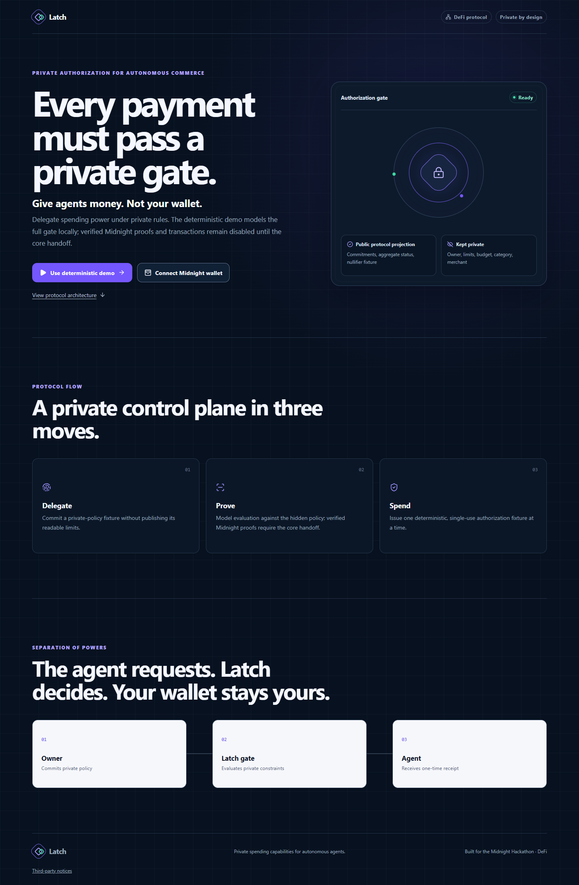
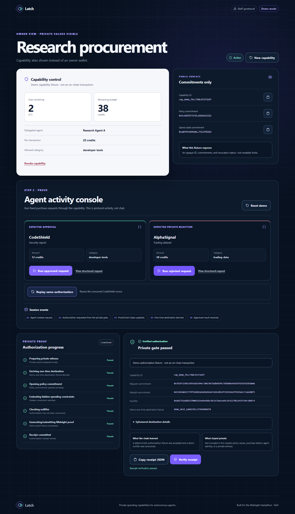
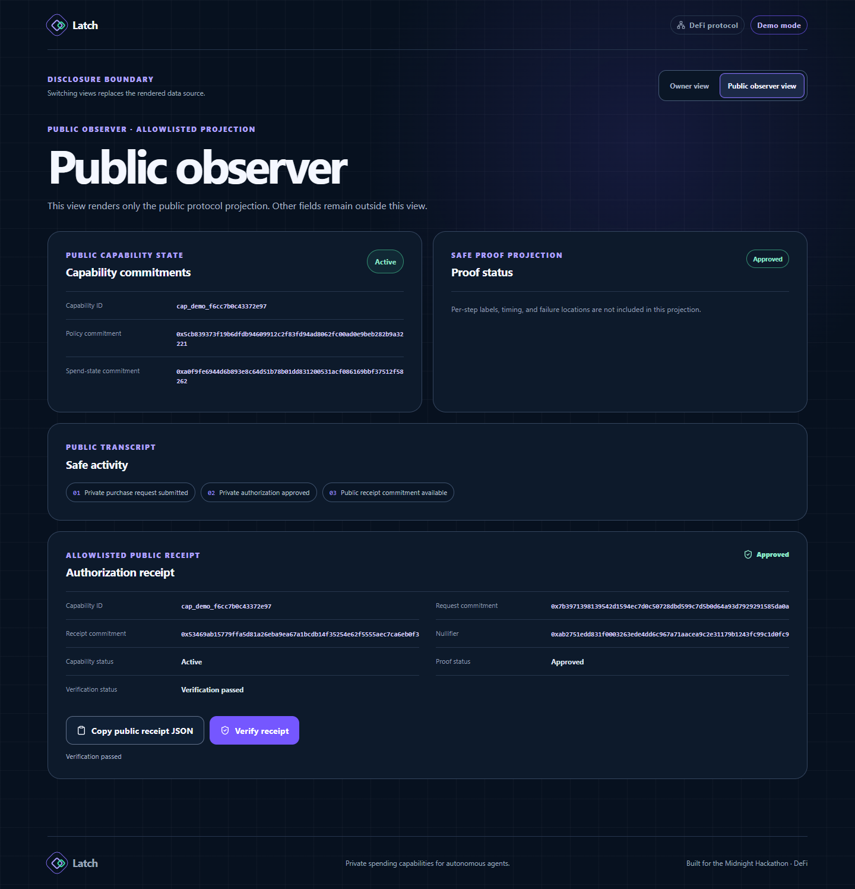
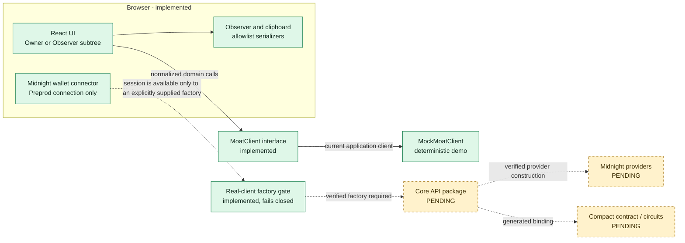

# Latch

> **Every payment must pass a private gate.**

Latch demonstrates a DeFi authorization design for autonomous commerce: an owner delegates bounded purchasing power, an agent proposes a purchase, and a private gate decides whether that request may proceed without giving the agent unrestricted wallet access.

The repository currently ships a complete, deterministic browser demo and a hardened Midnight Preprod wallet-connection boundary. The demo does **not** create a Midnight proof or transaction. Real capability, proof, receipt, and contract operations remain disabled until the independently owned core client is supplied and verified.



## The problem

An autonomous agent needs authority to pay for useful work, but handing it an unrestricted wallet collapses intent, policy enforcement, and custody into one dangerous permission. Conventional alternatives often move the policy to an operator that can read it, reveal the rule on-chain, or issue a reusable authorization.

Latch separates those concerns. The owner defines the spending policy; the agent supplies only a structured purchase request; the gate evaluates the request; and the resulting authorization is single-use. In the intended Midnight integration, private inputs stay on the approved private-state path while the public protocol surface contains only the minimum commitments and status needed for verification. That real disclosure behavior is not claimed until the core handoff is verified.

## The five-step Latch flow

| Step | Actor | Action | Intended result |
| --- | --- | --- | --- |
| 1. Delegate | Owner | Create a capability with a per-transaction limit, total budget, maximum uses, and allowed category. | A bounded policy exists without giving the agent an unrestricted wallet. |
| 2. Propose | Agent | Submit a structured purchase request containing a nonce, service, amount, category, and merchant meta-address. | The request is explicit and independently authorizable. |
| 3. Prove | Private gate | Evaluate the request against the committed policy and check its nullifier. | Only a request satisfying the hidden rules can be approved; real proof semantics are `[CORE FACT REQUIRED]`. |
| 4. Authorize | Gate / client | Commit a receipt and derive a one-time destination for an approved request. | The agent receives scoped authorization rather than wallet control; real receipt and destination semantics are `[CORE FACT REQUIRED]`. |
| 5. Prevent replay | Gate / client | Reject a request whose capability-and-nonce nullifier was already consumed. | The same authorization cannot be reused in the deterministic model; real contract enforcement is `[CORE FACT REQUIRED]`. |

## Public versus private

The implemented Owner and Public Observer views use separate React subtrees. Observer data is rebuilt from an explicit allowlist and rejects malformed public identifiers or commitments. This is a UI disclosure boundary, not authentication or same-origin access control.

| Data | Owner view | Public Observer view | Public receipt copy |
| --- | :---: | :---: | :---: |
| Capability ID and active/revoked status | Yes | Yes | Capability ID and safe status |
| Policy and spend-state commitments | Yes | Yes | No |
| Receipt and request commitments | Yes | Yes, after approval | Yes |
| Nullifier | Yes | Yes, after approval | Yes |
| Aggregate authorization / verification status | Yes | Yes | Yes |
| Agent name and owner-agent relationship | Yes | No | No |
| Per-transaction limit, total/remaining budget, maximum/remaining uses | Yes | No | No |
| Allowed/request category, amount, merchant, and service | Yes | No | No |
| Private rejection code and failed proof-step position | Yes | No; one fixed rejection message | No |
| One-time destination, ephemeral public key, and view tag | Yes | No | No |
| Wallet/provider configuration and wallet address | Connection boundary only; not rendered | No | No |
| Private witness, keys, seeds, and signing material | Never rendered or requested | Never | Never |

In Demo mode, all commitments are deterministic SHA-256 fixtures computed in the browser from known demo inputs. They are useful for stable behavior and tests, but they are **not hiding commitments** against a visitor who knows or can inspect those inputs.

| Owner approval view | Allowlisted Public Observer view |
| --- | --- |
|  |  |

## Architecture



React features depend only on normalized domain types and the [`MoatClient`](web/src/services/moat-client.ts) interface. [`MockMoatClient`](web/src/services/mock-moat-client.ts) implements that interface for the shipped demo. The wallet connector can discover and confirm a compatible Preprod wallet session, but the UI intentionally stops there. [`createRealMoatClient`](web/src/services/moat-adapter.ts) accepts only an explicitly supplied, verified factory and otherwise returns a fixed, safe handoff-required error.

The complete boundary map, data flows, state machines, async invariants, and integration replacement points are in [Architecture](docs/ARCHITECTURE.md).

## Midnight usage and Compact circuits

### Implemented and verified in this repository

- `@midnight-ntwrk/dapp-connector-api` is locked at `4.0.1` and imported for its connector types.
- Wallets are enumerated from `Object.values(window.midnight ?? {})`; no extension name is hardcoded.
- Connector versions must satisfy `^4.0.0`; multiple compatible wallets require explicit selection.
- The only real network offered by the current UI is `preprod` (displayed as **Preprod**).
- Before connection, wallet names are normalized and bounded, and only bounded raster `data:` icons are accepted.
- The connector requests permission hints only for `getConnectionStatus` and `getConfiguration`.
- A connection is accepted only when status and configuration both report `preprod`; status is checked again after configuration to close a switch/disconnect race.
- Provider configuration is validated as HTTPS/WSS data, copied to an in-memory session, and never displayed, logged, persisted, or copied to the clipboard.
- The connector does not request an address, balance, key, history, signing method, transfer method, or transaction method.
- Focus and visibility recovery trigger session revalidation. A stale or disconnected session removes the connected UI state.

### Core facts not yet supplied

No Ashiha/core package or Compact handoff is present on this branch. Therefore this repository makes no claim that a Compact contract compiles, that a circuit generates a proof, that a capability or receipt exists on a ledger, or that any address is deployed.

| Required fact | Current status | Documentation rule |
| --- | --- | --- |
| Core package/import path and exported client constructor | `[CORE FACT REQUIRED]` | Do not import or invent a client. |
| Exact core package versions and runtime assets | `[CORE FACT REQUIRED]` | Add only from the merged lockfile/handoff. |
| Compact module, circuit names, entry points, and generated bindings | `[CORE FACT REQUIRED]` | Do not name circuits based on the mock timeline. |
| Supported real network(s) | `[CORE FACT REQUIRED]` beyond the connector UI's Preprod request | Do not offer Preview or Mainnet. |
| Contract address or local deployment identifier | `[CORE FACT REQUIRED]` | Keep configuration blank; never fabricate an address. |
| Amount unit, scale, valid range, and core field mappings | `[CORE FACT REQUIRED]` | Preserve decimal strings at the frontend boundary. |
| Public/private classification of core inputs, outputs, and ledger fields | `[CORE FACT REQUIRED]` | Do not upgrade UI privacy into a contract privacy claim. |
| Proof event names, order, availability, and failure semantics | `[CORE FACT REQUIRED]` | Demo progress rows remain labeled fixtures. |
| Receipt verification and nullifier consumption semantics | `[CORE FACT REQUIRED]` | Do not infer contract enforcement from mock tests. |
| One-time destination representation | `[CORE FACT REQUIRED]` | The `demo_dest_` value is deliberately not a Midnight address. |
| Transaction hash and explorer URL rules | `[CORE FACT REQUIRED]` | Render neither unless returned by a verified real client. |
| Revocation semantics and finality | `[CORE FACT REQUIRED]` | Claim only deterministic in-memory revocation today. |
| Provider topology and disclosure guarantees | `[CORE FACT REQUIRED]` | Wallet configuration is an input, not proof of deployed topology. |

## Quick start

### Prerequisites

- Git.
- Node.js `22.13.0` or newer within the supported `22.x` release line. The
  workspace engine rejects Node 23+, and `.nvmrc` pins the verified minimum.
- npm with lockfile-v3 support. npm ships with supported Node releases.
- A modern browser with Web Crypto. No wallet, backend, account, environment file, or external service is required for Demo mode.

### Run from a clean clone

```bash
git clone https://github.com/CipherCollective/Latch.git
cd Latch
git switch feat/atharv/docs
npm ci
npm run dev
```

The explicit branch switch is required until the final integration PR reaches the default branch; after that merge, a plain default-branch clone is sufficient. Open the local URL printed by Vite (normally `http://localhost:5173`). Choose **Use deterministic demo**. No environment variable is needed for this path.

### Public deployment status

The production-base static bundle is committed under `docs/` and has passed the
full local hosted-artifact browser matrix. No live URL is claimed: GitHub's
Pages API returned HTTP `422` because the current plan does not support Pages
for this private organization repository, and no authorized alternative-host
credential is available. See the [deployment record](docs/DEPLOYMENT.md) for
artifact hashes, reproduction commands, smoke-test results, and the exact
unblock options.

### Verify the workspace

```bash
npm run typecheck
npm run test:run
npm run build
npm audit --audit-level=low
```

At the time this document was written, the suite contained 130 passing tests across 17 files. The pass condition is the command exit status, not that historical count. A lint script is not currently configured.

### Exercise the wallet boundary

Choose **Connect Midnight wallet** with a compatible DApp Connector API 4.x wallet enabled in the browser. Select a wallet explicitly if more than one is available, authorize a **Preprod** connection, and confirm the connected summary. This validates the connector boundary only. The screen intentionally provides no capability or transaction action until the verified core factory exists. Demo mode remains available from every wallet state.

## Demo scenario

The complete demo is deterministic, local, and reset on refresh:

1. Choose **Use deterministic demo**.
2. Review the default private capability: `Research procurement`, `Research Agent A`, 20-credit per-transaction limit, 50-credit total budget, 3 uses, and `developer-tools` category.
3. Create the capability. The browser derives stable capability, policy, and spend-state fixture commitments.
4. Run **CodeShield**. Its 12-credit `developer-tools` request is approved; uses change from 3 to 2 and budget from 50 to 38. The UI shows a deterministic receipt, nullifier, and `demo_dest_...` one-time destination fixture.
5. Verify the receipt. Only a receipt committed by the current in-memory mock session verifies.
6. Run **AlphaSignal**. Its 30-credit `trading-data` request is rejected without mutating budget, uses, commitments, nullifiers, or receipts. Owner view may show a local reason; Observer view always shows the same generic rejection.
7. Replay **CodeShield**. The same capability-and-request-nonce nullifier is detected before policy evaluation, so the replay is rejected without state mutation.
8. Switch between **Owner** and **Public Observer**. The Observer subtree contains only allowlisted protocol fields and aggregate progress.
9. Revoke the capability. Later authorizations are blocked in the deterministic session.
10. Use **New capability** or **Reset demo** to return to the policy form; committing again replaces the mock capability state. Refresh creates a new in-memory demo client.

Demo artifacts use `networkId: "demo"` and `tx.kind: "demo-fixture"`. They never contain a real transaction hash or explorer URL.

## Security limitations

- **Not a production system.** The repository has not been presented as independently audited, formally verified, custody-ready, or mainnet-ready.
- **No real core execution yet.** A wallet connection does not create a capability, proof, receipt, revocation, or transaction. The real adapter fails closed until a verified factory is injected.
- **Demo privacy is illustrative.** Demo policy values and request fixtures live in the browser, and deterministic SHA-256 values can be recomputed from known inputs. They are not zero-knowledge commitments.
- **Observer mode is a projection, not access control.** It removes private nodes from its React DOM, accessible tree, transcript, and clipboard payload, but owner state remains in the same page session and demo fixture source is shipped to the browser.
- **Browser memory is not a hardened enclave.** Policy, request, and owner receipt values exist in memory while the demo runs. The application intentionally does not persist them in local or session storage.
- **Wallet injection is untrusted.** The connector validates metadata, versions, status, network, and endpoint shapes and maps raw errors to fixed copy, but a malicious extension retains the privileges granted to that extension/browser context.
- **Provider metadata is not transaction-graph privacy.** Reading wallet-selected endpoints does not establish privacy properties for nodes, indexers, provers, network observers, wallets, or eventual ledger activity.
- **Frontend controls are not contract guarantees.** Replay, budget, category, use-count, and revocation invariants are thoroughly tested in `MockMoatClient`; real enforcement remains `[CORE FACT REQUIRED]`.
- **No secrets belong in frontend configuration.** Any future `VITE_*` value is public at build time. Never place a seed, signing key, witness, private policy, wallet credential, or API secret there.

See [Architecture](docs/ARCHITECTURE.md), the [build specification](docs/LATCH_ATHARV_BUILD_SPEC.md), the [deployment record](docs/DEPLOYMENT.md), and the append-only [build log](docs/BUILD_LOG.md) for the detailed trust boundaries and evidence record.

## Fresh work and locked dependencies

The Latch code, visual design, diagrams, documentation, and demo fixtures in the Atharv/Codex workstream were created for this Midnight Hackathon from the supplied Atharv build brief. No code, assets, text, diagrams, or repository history from ShadowKey, Veil Protocol, or older team projects was imported. The append-only [build log](docs/BUILD_LOG.md) records the implementation sequence and checks.

`package-lock.json` (lockfile version 3) is the dependency authority. Direct versions currently locked are:

| Runtime dependency | Version |
| --- | ---: |
| `@midnight-ntwrk/dapp-connector-api` | `4.0.1` |
| `lucide-react` | `1.25.0` |
| `react` | `19.2.7` |
| `react-dom` | `19.2.7` |
| `semver` | `7.8.5` |

| Development dependency | Version |
| --- | ---: |
| `@testing-library/jest-dom` | `6.9.1` |
| `@testing-library/react` | `16.3.2` |
| `@types/react` | `19.2.14` |
| `@types/react-dom` | `19.2.3` |
| `@types/semver` | `7.7.1` |
| `@vitejs/plugin-react` | `6.0.3` |
| `jsdom` | `29.1.1` |
| `typescript` | `7.0.2` |
| `vite` | `8.1.5` |
| `vitest` | `4.1.10` |

The project is licensed under the [MIT License](LICENSE). Runtime dependency attributions and complete license texts ship with the browser build in [Third-party notices](web/public/THIRD_PARTY_NOTICES.txt).

## Business value and roadmap

Latch turns broad wallet delegation into a narrow, reviewable authorization primitive. That matters for agent procurement, research services, developer tooling, treasury automation, and any autonomous workflow where the requestor should receive spending power without receiving custody. The protocol can make hidden commercial policy compatible with public verification: owners can limit exposure, agents can act within a mandate, and observers can validate minimal public artifacts without seeing the business rule.

The roadmap is evidence-gated:

1. Receive and review the core handoff facts listed above.
2. Implement the real client only through `web/src/services/moat-adapter.ts`, provider selection, configuration typing, and adapter tests.
3. Prove amount mapping, error redaction, receipt verification, nullifier/replay handling, revocation, and optional transaction metadata against the actual core package.
4. Add an independently accessible Public Observer route backed by a public-only data source; do not treat the current in-session toggle as authentication.
5. Verify a public static deployment in an incognito browser, with Demo mode available without a wallet or service dependency.
6. Obtain security review, define production key/provider operations, and document ledger/network metadata before making any production or privacy claim.
