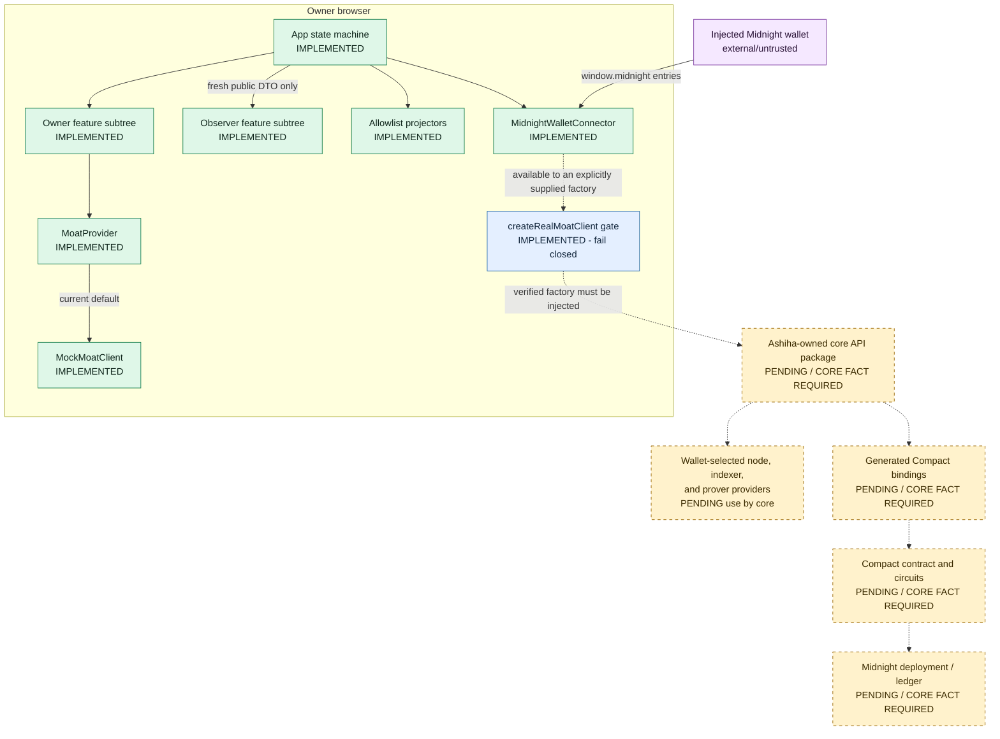
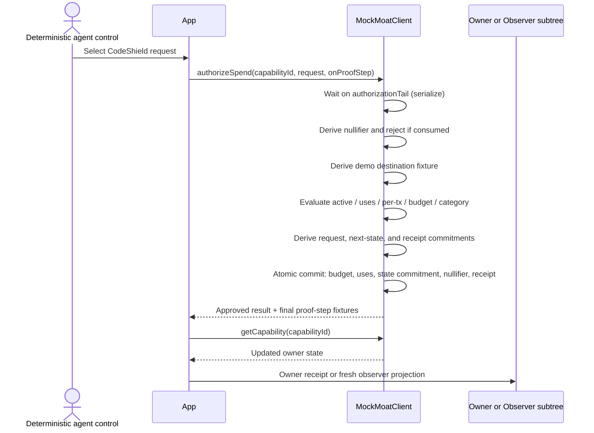
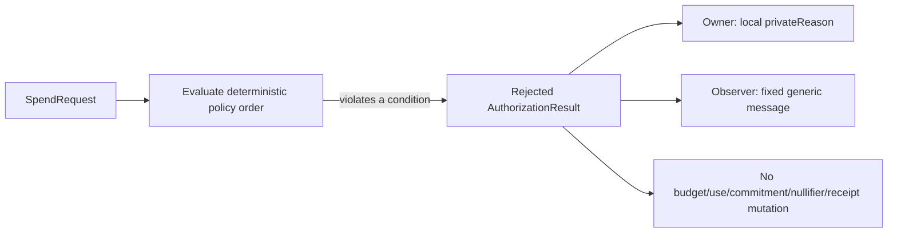
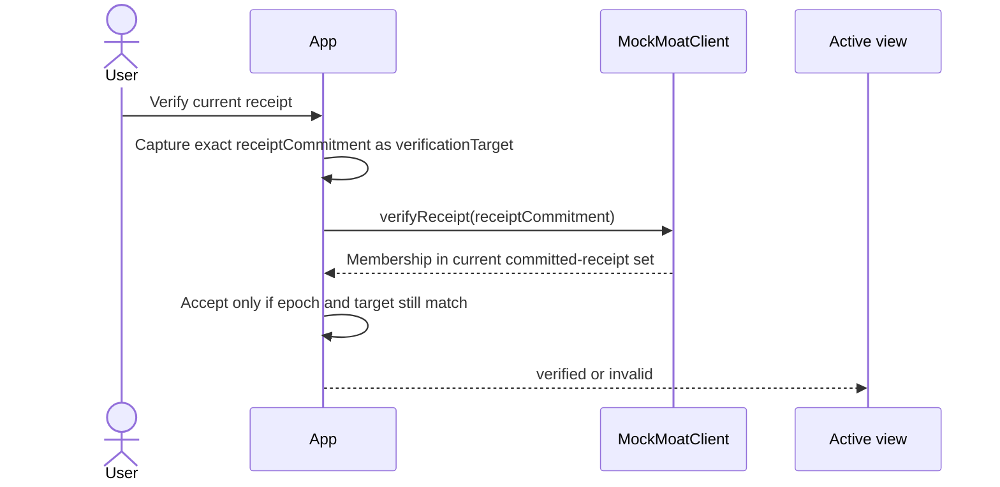
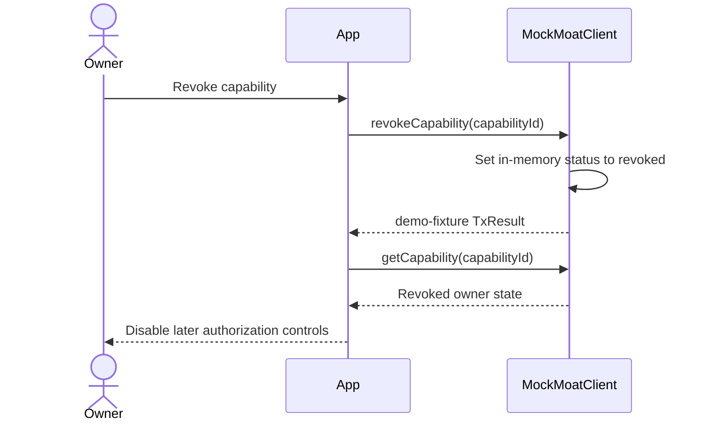
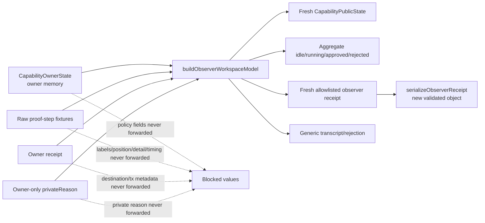
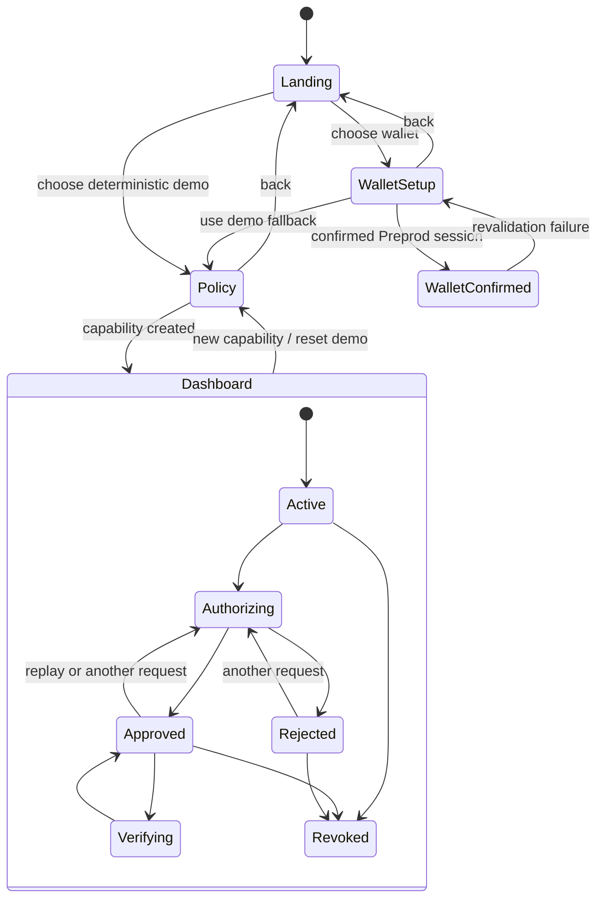
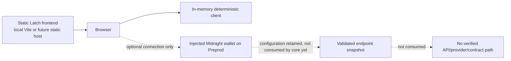

# Latch Architecture

## Status and scope

This document describes the code that exists in the Atharv/Codex workstream and the deliberately unimplemented real-core layers. It is a boundary and integration document, not evidence that a Compact contract, proof service, or deployment exists.

| Item | Current state |
| --- | --- |
| React/Vite product UI | Implemented |
| Deterministic capability, authorization, receipt, replay, verification, and revocation model | Implemented in browser memory |
| Owner/Public Observer structural projection | Implemented and tested |
| Midnight DApp Connector discovery and Preprod session confirmation | Implemented |
| Normalized `MoatClient` frontend contract | Implemented |
| Real-client factory seam | Implemented; fails closed without a supplied factory |
| Core API package and generated Compact binding | `[CORE FACT REQUIRED]` |
| Compact modules/circuits and ledger behavior | `[CORE FACT REQUIRED]` |
| Deployed or local contract address | `[CORE FACT REQUIRED]` |
| Public real-provider topology | `[CORE FACT REQUIRED]` |
| Public frontend deployment URL | `[DEPLOYMENT FACT REQUIRED]` |

The product name is **Latch**. The service boundary remains `MoatClient` to preserve the frozen integration name in the source brief.

## Architectural rule

React components consume normalized domain types and a `MoatClient`; they do not import generated Compact bindings, contract artifacts, provider constructors, connector `ConnectedAPI` types, or independently owned API internals.

```text
React feature -> useMoatClient() -> MoatProvider -> MoatClient
                                               -> MockMoatClient (current demo)
                                               -> verified real adapter (pending handoff)
```

The wallet connector is a separate boundary. A confirmed wallet session is an input to a future real-client factory; it is not itself a `MoatClient` and is not proof that capability actions are available.

## System context: implemented versus pending



Solid arrows are paths exercised by current code. Dashed arrows are integration targets, not shipped runtime paths.

## Implemented component map

| Layer | Primary path | Responsibility | Must not do |
| --- | --- | --- | --- |
| Application composition | [`web/src/main.tsx`](../web/src/main.tsx) | Mount the error boundary, `MoatProvider`, and application. | Construct proof providers or import generated bindings. |
| UI state machine | [`web/src/App.tsx`](../web/src/App.tsx) | Select landing/wallet/demo screens, coordinate lifecycle operations, proof updates, receipts, verification, mode switching, and reset. | Read wallet/provider internals or render unnormalized core payloads. |
| Domain contract | [`web/src/types/domain.ts`](../web/src/types/domain.ts) | Define exact decimal-string policy/request types, capability states, proof statuses, receipts, transaction result, wallet snapshot, and safe public errors. | Encode core-only private structures. |
| Client port | [`web/src/services/moat-client.ts`](../web/src/services/moat-client.ts) | Define the client methods consumed by UI features. | Depend on a concrete demo or Compact implementation. |
| Client provider | [`web/src/services/moat-provider.tsx`](../web/src/services/moat-provider.tsx) | Supply one stable `MoatClient`; default to the deterministic client or accept a test/supplied client. | Guess a real client from wallet state. |
| Deterministic adapter | [`web/src/services/mock-moat-client.ts`](../web/src/services/mock-moat-client.ts) | Model capability creation, private-policy evaluation, proof-step fixtures, atomic approval mutation, receipt verification, replay, and revocation. | Claim ledger, Compact, transaction, or zero-knowledge execution. |
| Real adapter seam | [`web/src/services/moat-adapter.ts`](../web/src/services/moat-adapter.ts) | Accept a verified `ConnectedWalletSession -> MoatClient` factory; return fixed safe failure when absent. | Import an unverified API or infer field mappings. |
| Wallet boundary | [`web/src/wallet/midnight-wallet-connector.ts`](../web/src/wallet/midnight-wallet-connector.ts) | Discover hostile injected entries, semver-check, connect only to Preprod, minimize permissions, validate status/configuration, and revalidate sessions. | Request balances, keys, addresses, signing, history, or transaction privileges for display. |
| Wallet UI | [`web/src/features/wallet/WalletConnectionPanel.tsx`](../web/src/features/wallet/WalletConnectionPanel.tsx) | Explicit selection, recovery states, connection confirmation, and Demo fallback. | Expose provider endpoints or offer a fake real action. |
| Decimal boundary | [`web/src/lib/decimal.ts`](../web/src/lib/decimal.ts) | Parse, compare, canonicalize, and subtract non-negative decimal strings with up to six fractional digits. | Coerce through JavaScript `number` or accept signs/exponents/whitespace. |
| Fixture hashing | [`web/src/demo/fixture-hash.ts`](../web/src/demo/fixture-hash.ts) | Domain-separate canonical inputs and derive stable SHA-256 fixture values with Web Crypto. | Present fixture hashes as hiding commitments or real chain artifacts. |
| Owner clipboard | [`web/src/lib/receipt-serialization.ts`](../web/src/lib/receipt-serialization.ts) | Build an explicit owner receipt shape, type-check copied leaves, allowlist transaction kind/network enums, and rely on the UI's separate HTTPS check before rendering an explorer link. | Spread runtime objects, copy injected fields, or claim unknown core hash/address-format validation. |
| Observer projection | [`web/src/privacy/observer-serializer.ts`](../web/src/privacy/observer-serializer.ts) | Construct fresh public capability/receipt/workspace DTOs, validate opaque values, and collapse proof state to an aggregate. | Receive or forward owner transcript events, raw proof details, destinations, private reasons, or transaction metadata. |
| Error containment | [`web/src/app/AppErrorBoundary.tsx`](../web/src/app/AppErrorBoundary.tsx) and [`web/src/app/react-error-options.ts`](../web/src/app/react-error-options.ts) | Suppress React's raw root callbacks and show fixed recovery copy when rendering fails. | Dump raw errors or private payloads. |

The target structure is a boundary map rather than a file-count rule; adjacent UI modules are intentionally grouped where the ownership direction stays clear.

## `MoatClient` boundary

The UI-facing interface contains seven operations:

| Method | Normalized input | Normalized result | Current implementation |
| --- | --- | --- | --- |
| `connectWallet()` | None | `WalletSnapshot` | Demo returns disconnected `networkId: "demo"`; real wallet connection currently lives in the dedicated connector UI. |
| `createCapability(input)` | `CreateCapabilityInput` with decimal strings | Capability ID, commitments, status, label, optional `TxResult` | Deterministic fixture |
| `authorizeSpend(input)` | Capability ID, `SpendRequest`, optional proof callback | Approved receipt or fixed public rejection plus owner-only code | Deterministic fixture |
| `revokeCapability(id)` | Capability ID | `TxResult` | Deterministic fixture |
| `getCapability(id)` | Capability ID | Owner or public normalized state | Deterministic fixture |
| `verifyReceipt(commitment)` | Receipt commitment | Boolean | Current-session committed-receipt set |
| `generateOneTimeDestination(merchant, nonce)` | Normalized merchant meta-address and request nonce | Destination, ephemeral public key, view tag, fixture flag | Deterministic fixture |

Feature components do not know whether these methods are implemented by a mock or a real adapter. Real integration should preserve this interface or make a narrowly reviewed normalization change at the adapter boundary.

### Current client selection

`main.tsx` mounts `MoatProvider` without a supplied client, so the provider constructs one `MockMoatClient` for the application lifetime. Selecting Demo exposes the capability workflow backed by that client. Selecting Wallet opens `WalletConnectionPanel`; even after a wallet is confirmed, capability actions remain unavailable and the provider is not silently replaced.

This is intentional fail-closed behavior. A future verified integration must make the mode-to-client selection explicit, provide a real factory, and ensure a late Demo or wallet response cannot replace the active client after a mode change.

## Runtime data flows

### Create capability

```mermaid
sequenceDiagram
  actor Owner
  participant UI as PolicyBuilder / App
  participant Client as MockMoatClient
  participant Hash as canonicalJson + Web Crypto

  Owner->>UI: Submit alias and PolicyInput
  UI->>UI: Validate exact decimal strings and form fields
  UI->>Client: createCapability(normalized input)
  Client->>Hash: Hash capability-id domain
  Client->>Hash: Hash policy-commitment domain
  Client->>Hash: Hash spend-state-commitment domain
  Hash-->>Client: Stable 0x-prefixed SHA-256 fixtures
  Client->>Client: Replace in-memory capability; clear nullifiers and receipts
  Client-->>UI: CreateCapabilityResult (demo-fixture, demo network)
  UI->>Client: getCapability(capabilityId)
  Client-->>UI: Fresh owner-state copy
  UI-->>Owner: Render dashboard
```

Key rules:

- Amounts remain decimal strings; the demo never converts them through floating point.
- Duplicate lifecycle submissions are guarded in `App`.
- Capability creation starts a new deterministic in-memory capability and clears prior mock receipts/nullifiers.
- No policy value is written to local storage, session storage, a URL, a backend, or a console.

### Authorize an approved request



The demo's atomic commit point is synchronous: capability mutation, nullifier consumption, and receipt registration occur together after all approval conditions and hashes succeed. Any rejected path before that point leaves those sets and values unchanged.

### Authorize a policy rejection



The owner-only code may distinguish per-transaction limit, total budget, maximum uses, category, replay, revoked, or unknown. Every observer rejection becomes exactly `Authorization rejected. No private policy values were disclosed.` Raw proof labels, failed positions, details, and timings are removed from the observer model.

### Verify receipt



The target check prevents a response for an earlier receipt from marking a later receipt verified. In real mode, what verification queries and what `true` means are `[CORE FACT REQUIRED]`.

### Replay

```mermaid
sequenceDiagram
  actor Agent
  participant App
  participant Client as MockMoatClient

  Agent->>App: Replay CodeShield fixture
  App->>Client: authorizeSpend(same capabilityId and requestNonce)
  Client->>Client: Derive same domain-separated nullifier
  Client->>Client: Check consumed set before private policy evaluation
  Client-->>App: REPLAY rejection; nullifier step failed
  App->>Client: getCapability(capabilityId)
  Client-->>App: Unchanged capability state
```

Replay is checked before deriving or announcing a destination and before evaluating private constraints. This makes the demo outcome deterministic and avoids leaking a different policy failure. Contract-level nullifier enforcement is `[CORE FACT REQUIRED]`.

### Revoke



The current UI blocks new authorizations for a revoked capability, and the mock also rejects revoked state. Finality, authorization races against a real revocation transaction, and ledger semantics are `[CORE FACT REQUIRED]`.

## Wallet and provider flow

```mermaid
sequenceDiagram
  actor Owner
  participant Panel as WalletConnectionPanel
  participant Conn as MidnightWalletConnector
  participant Registry as window.midnight
  participant Wallet as Selected wallet API
  participant Gate as createRealMoatClient

  Panel->>Conn: discover()
  Conn->>Registry: Object.values(untrusted registry)
  Conn-->>Panel: Safe names/icons, versions, opaque IDs, compatibility
  Owner->>Panel: Explicitly select and connect
  Panel->>Conn: connect(id, preprod)
  Conn->>Wallet: connect("preprod") with receiver preserved
  Conn->>Wallet: hintUsage(getConnectionStatus, getConfiguration)
  Conn->>Wallet: getConnectionStatus()
  Conn->>Wallet: getConfiguration()
  Conn->>Wallet: getConnectionStatus() again
  Conn-->>Panel: ConnectedWalletSession in memory
  Panel-->>Owner: Connection confirmed; no capability/transaction submitted
  Note over Panel,Gate: No verified factory is configured today
  Note right of Panel: No real action is offered
```

### Connector invariants

- Registry enumeration and property access are wrapped because getters and proxies are untrusted.
- Wallet IDs are generated locally; duplicate or hostile names are never used as object keys.
- Names are NFKC-normalized, control/bidirectional characters and angle brackets are removed, whitespace is collapsed, and output is capped.
- Icons are optional, bounded base64 PNG/JPEG/WebP `data:` URLs. SVG, HTML, `javascript:`, HTTP(S), and oversized values are rejected.
- API versions must be exact valid semantic versions satisfying `^4.0.0`.
- Only `preprod` is callable through the current connector, even though the shared domain type reserves other network labels.
- Permission hints and calls are limited to connection status and configuration. No address or balance is requested.
- Indexer HTTP uses HTTPS; indexer WebSocket and substrate node use WSS; optional prover uses HTTPS. Credentials and malformed/oversized endpoints fail closed.
- Network agreement is checked before and after configuration so a switch or disconnect during the read is not accepted.
- The connected session retains the connector object and a plain copied configuration only in memory. It is passed only to an explicitly supplied verified factory.
- Window focus and return to a visible document revalidate the session. Failure clears the App's connected badge.
- Raw wallet reasons, stacks, provider payloads, and endpoints are translated to fixed public error objects.

The wallet's endpoint configuration describes a user-selected input. The actual API/provider construction, which endpoint each provider uses, and what each provider learns are `[CORE FACT REQUIRED]`.

## Observer projection and disclosure flow



Observer mode renders `ObserverWorkspace` with an `ObserverWorkspaceModel`; it does not pass the owner state object and then hide fields with CSS. Public IDs and commitments are validated before projection. Receipt copying constructs another fresh object with only:

- capability ID;
- request commitment;
- receipt commitment;
- nullifier;
- capability status;
- approved proof status; and
- verification status.

Hostile-input tests recursively inspect both key names and serialized values. App-level tests switch during active proof callbacks, inspect DOM mutation snapshots, unmount open owner dialogs, and verify clipboard output.

### Important limitation

The view toggle is a structural DOM/accessibility/clipboard projection inside one browser session. It is not authentication, origin separation, process isolation, or a public data API. Owner data remains in React/client memory. A genuinely public observer surface requires a separately accessible route or application whose input is a public-only core data source.

## Application state and async invariants

### State overview



`WalletConfirmed` is terminal for real actions in the current UI: it confirms only the connector session and explains the core handoff gate.

### Concurrency and stale-response rules

| Invariant | Mechanism | Failure prevented |
| --- | --- | --- |
| A reset or mode switch invalidates older application work. | Monotonic `operationEpoch` captured by every lifecycle/authorization/verification action. | Late capability, proof, receipt, or error state appearing in a new mode/session. |
| Only one capability lifecycle action runs at once. | `lifecycleInFlight` ref plus disabled controls. | Duplicate create/revoke calls before React re-render. |
| Only one UI authorization runs at once. | `authorizationInFlight` ref plus disabled controls. | Double-click duplicate authorization. |
| The mock serializes even direct concurrent calls. | `authorizationTail` promise queue. | Two same-nonce requests both committing before nullifier consumption. |
| Proof states never regress. | Status rank and terminal-state guard in `upsertProofStep`. | Passed/failed rows returning to waiting/running or flipping terminal result. |
| Presentation callbacks cannot alter authorization semantics. | Mock catches callback failures. | A rendering callback aborting or changing policy evaluation. |
| Verification applies only to its exact receipt. | `verificationTarget` commitment plus epoch check. | Stale verification approving a newer receipt. |
| Wallet Back/Demo/refresh invalidates pending work. | Panel-local operation epoch and leave handler. | Late wallet authorization restoring a departed screen. |
| Rapid connect activation produces one request. | `connectionInFlight` ref. | Duplicate wallet permission prompts. |
| Focus/visibility checks do not overlap. | `validationInFlight` ref and active cleanup guard. | Revalidation races and state updates after unmount. |
| Wallet status cannot switch during accepted configuration. | Status -> configuration -> status sequence with matching Preprod IDs. | Accepting stale endpoints after disconnect/network switch. |

## Error and truthfulness boundaries

Errors are data-classified at their source:

- Wallet-controlled failures are converted to fixed `PublicClientError` copy. Raw messages, reasons, stacks, provider objects, and endpoints never reach React.
- The absent core factory throws `CoreHandoffRequiredError` with one fixed public message and no session payload.
- Demo authorization catches display callback exceptions so they cannot change authorization results.
- App recoverable errors claim neither approval nor transaction completion.
- The application error boundary offers reset without dumping raw error objects.
- The Observer projection discards private rejection codes and returns one exact public rejection string.

The UI renders `txHash` or `explorerUrl` only when a future normalized result explicitly contains them and its transaction kind is real. Demo `TxResult` is always `{ kind: "demo-fixture", networkId: "demo" }` and supplies neither field.

## Browser-memory and persistence model

The current implementation has no backend, database, login, analytics service, external LLM, route-carried private values, local storage, or session storage. The following values exist in JavaScript memory during a demo session:

- owner policy and remaining limits;
- fixed merchant/request fixtures;
- generated demo capability, request, spend-state, receipt, destination, key, tag, and nullifier fixtures;
- consumed-nullifier and approved-receipt sets;
- owner transcript and proof-step state; and
- a confirmed wallet session and provider configuration, if the owner connects a wallet.

Refresh, Return home, and reset paths replace UI state. A browser refresh creates a new `MockMoatClient`. JavaScript memory is not a confidentiality enclave, and the deterministic fixture inputs also exist in the shipped bundle.

## Ownership and integration replacement points

| Area | Owner | Permitted integration change | Protected boundary |
| --- | --- | --- | --- |
| `web/**` product UI, adapters, tests | Atharv/Codex | Maintain normalized domain and service surfaces. | Components must not import Compact/core internals. |
| `docs/**`, root README, public config | Atharv/Codex | Replace placeholders only with cited, reviewed core evidence. | No secrets or invented addresses/claims. |
| `api/**` | Ashiha/core owner | Expose the verified client constructor and normalized facts for the adapter. | Atharv workstream does not create competing bindings. |
| `contract/**` | Ashiha/core owner | Supply compiled/tested contract artifacts and evidence. | Atharv workstream does not edit the path. |
| `web/src/services/moat-adapter.ts` | Integration seam | Import the verified factory/client and translate core values/errors. | Do not leak private core fields into domain/public DTOs. |
| `web/src/services/moat-provider.tsx` | Integration seam | Explicitly select mock versus verified real client. | Demo stays independently runnable and truthfully labeled. |
| Configuration typing / `.env.example` | Integration seam, if needed | Add only verified public network/address/asset values. | Every `VITE_*` value is public; never add credentials or witnesses. |
| Adapter-specific tests | Shared review | Prove exact mappings, optional fields, redaction, and failure behavior. | Mock behavior is not evidence of core behavior. |

### Minimal real-integration sequence

1. Receive every fact in the ledger below with package/commit/test evidence.
2. Install or link the verified core package without copying generated internals into UI code.
3. Implement a `VerifiedCoreClientFactory` in the adapter and map exact core values to normalized decimal-string/domain types.
4. Select that client only after a wallet session is confirmed and the public configuration is valid.
5. Keep Demo mode bound to `MockMoatClient`; never reuse real badges, hashes, addresses, or explorer copy for fixtures.
6. Add adapter contract tests for amount precision, error translation, `BigInt` serialization, absent optional transaction fields, and private-field stripping.
7. Exercise create, approve, policy rejection, replay, verify, and revoke against the real client and record exact evidence.
8. Update documentation placeholders only after the evidence passes review.

Changes outside the adapter, provider selection/configuration typing, and integration tests require an explicit architecture review because they suggest the core API is leaking into features.

## Provider and deployment topology

### Verified current topology

- Demo: one static React application and one in-browser `MockMoatClient`; no backend or external provider is required.
- Wallet boundary: an injected connector can return Preprod status and its node/indexer/prover configuration; the configuration is validated and retained in memory only.
- Real core: no core factory is injected by the application.
- Contract/deployment: no address is configured or documented.
- Public frontend deployment URL: `[DEPLOYMENT FACT REQUIRED]`.



This diagram must be replaced, not extended by assumption, after the core handoff identifies the real providers and deployment.

### `[CORE FACT REQUIRED]` ledger

| Integration fact | Evidence required before documentation or code claim | Current value |
| --- | --- | --- |
| Core package/import path | Merged package manifest plus exported constructor/type | `[CORE FACT REQUIRED]` |
| Core dependency versions | Merged lockfile entries | `[CORE FACT REQUIRED]` |
| Runtime/proving assets | Package docs plus clean-start test | `[CORE FACT REQUIRED]` |
| Supported network IDs | Core test/config evidence | `[CORE FACT REQUIRED]` |
| Contract address or local deployment ID | Deployment output and independent lookup/test | `[CORE FACT REQUIRED]` |
| Compact source module and circuit/entry-point names | Source path, generated bindings, compiler/test output | `[CORE FACT REQUIRED]` |
| Capability create input/output fields | Exported types plus passing integration test | `[CORE FACT REQUIRED]` |
| Amount base unit, scale, and range | Core type/contract source plus boundary cases | `[CORE FACT REQUIRED]` |
| Authorization input/output fields | Exported types plus allow/reject/replay tests | `[CORE FACT REQUIRED]` |
| Public/private classification | Field-by-field core-owner review and ledger/proof evidence | `[CORE FACT REQUIRED]` |
| Proof event availability and semantics | Actual callback/event interface and captured run | `[CORE FACT REQUIRED]` |
| Receipt verification semantics | Source/test showing what is verified and at what finality | `[CORE FACT REQUIRED]` |
| Nullifier derivation/consumption | Source/test showing domain, uniqueness, and atomicity | `[CORE FACT REQUIRED]` |
| One-time destination format | Exported type plus generated verified example | `[CORE FACT REQUIRED]` |
| Transaction hash and explorer rules | Real normalized result plus network-specific explorer policy | `[CORE FACT REQUIRED]` |
| Revocation and authorization-race semantics | Contract/client tests and finality definition | `[CORE FACT REQUIRED]` |
| Provider constructors and endpoint mapping | Core factory source and wallet-config integration test | `[CORE FACT REQUIRED]` |
| What wallet/node/indexer/prover/ledger observers learn | Reviewed threat model tied to implemented topology | `[CORE FACT REQUIRED]` |
| Public observer data source | Endpoint/query/ledger mapping containing only approved fields | `[CORE FACT REQUIRED]` |
| Public deployment URL and static routing | Incognito smoke test against deployed build | `[DEPLOYMENT FACT REQUIRED]` |

Until a row has evidence, its required placeholder remains unchanged; the mock is never accepted as evidence for any core or deployment fact.

## Verification strategy

The current architecture is protected at several layers:

- pure units for exact decimals, canonical JSON, fixture hashes, receipt serializers, and observer projection;
- deterministic client tests for approval mutation, rejection non-mutation, concurrent replay, verification, and revocation;
- hostile wallet tests for proxies/getters, metadata, semantic versions, receiver binding, permission minimization, wrong-network races, endpoint validation, and raw-error redaction;
- component tests for wallet discovery/recovery, focus, duplicate/stale operations, proof monotonicity, receipt rendering, and native-control behavior;
- App-level privacy tests for DOM removal across owner/observer switching and copied public receipt shape;
- TypeScript project references and a production Vite build; and
- manual desktop/mobile/320px browser flows with screenshot evidence under [`docs/screenshots`](screenshots).

Repository-level verification commands are:

```bash
npm run typecheck
npm run test:run
npm run build
npm audit --audit-level=low
```

At this document revision, `npm run test:run` reports 130 passing tests in 17 files. This number is an audit snapshot, not a substitute for rerunning the commands.

## Architecture non-claims

This architecture does not claim:

- a real zero-knowledge proof in Demo mode;
- a compiled or deployed Compact contract;
- a real capability, receipt, nullifier, address, block, transaction hash, or explorer URL;
- Mainnet or Preview support;
- confidentiality of deterministic fixture hashes;
- authentication or origin isolation for the in-session Observer toggle;
- total transaction-graph privacy;
- security audit, formal verification, custody safety, or production readiness; or
- contract enforcement based only on frontend/mock tests.

Verified core facts can refine these statements only through the adapter and evidence process above.
