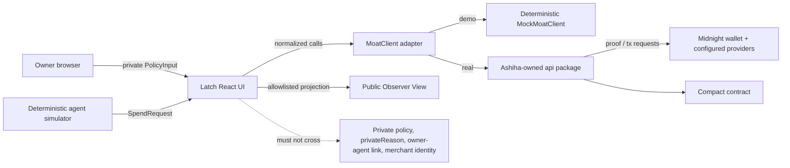

# Latch - Atharv/Codex Build Specification

> **Product promise:** Every payment must pass a private gate.

| Document field | Value |
| --- | --- |
| Status | Implementation-ready specification |
| Version | 1.0 |
| Date | 18 July 2026 |
| Product owner | Atharv |
| Implementation owner | Atharv + Codex |
| Cross-reviewer | Ashiha |
| Primary track | DeFi |
| Source authority | `MOAT_Atharv_Codex_Build_Brief.pdf` only |
| In scope | Product UI, deterministic demo, frontend adapter, documentation, deployment, integration and submission support |
| Out of scope | `contract/**`, Ashiha-owned `api/**`, and the Ashiha/Cursor implementation brief |

## 1. Purpose and authority

This document turns the Atharv/Codex PDF into an executable frontend and product specification for **Latch**. It deliberately does not reinterpret or incorporate the Ashiha/Cursor brief. Where the source brief uses the working name **MOAT**, this specification uses **Latch** in product copy and UI. The frozen integration boundary remains named `MoatClient` until both owners explicitly approve a coordinated rename; preserving that name prevents an avoidable integration mismatch with Ashiha's independently built package.

Requirements use the following terms:

- **MUST / MUST NOT:** release-blocking requirement.
- **SHOULD / SHOULD NOT:** expected behavior; deviation requires a written reason in `docs/BUILD_LOG.md`.
- **MAY:** optional and cuttable without compromising the core demonstration.
- **[CORE FACT REQUIRED]:** a value that must come from Ashiha's verified handoff. It must never be guessed.

If this specification conflicts with verified behavior of the merged core client, the implementation must preserve privacy and truthfulness, record the conflict, and adapt only the frontend adapter. React feature components must not be rewritten around generated Compact bindings.

## 2. Product definition

### 2.1 Locked statement

Latch is a confidential spending-capability protocol that lets a person delegate limited purchasing power to an autonomous agent. A user commits a private spending policy. An agent proposes a purchase. Midnight proves that the request satisfies hidden limits, consumes a single-use authorization, and commits a verifiable receipt without exposing the owner, wallet relationship, remaining budget, category rule, purchase amount, merchant relationship, or transaction graph beyond the minimum public protocol data.

Latch is presented as **DeFi infrastructure for autonomous commerce**, not as an AI assistant. The agent is a protocol customer. The judged innovation is private financial authorization and verifiable spending control.

### 2.2 Core value proposition

Existing agent payment patterns tend to grant broad wallet access, reveal policy details to an intermediary, or rely on an off-chain operator to enforce limits. Latch inserts a private authorization gate between intent and payment:

1. **Delegate:** the owner creates a capability with hidden limits.
2. **Propose:** an agent emits a structured purchase request.
3. **Prove:** the request is evaluated against committed rules.
4. **Authorize:** an approved request receives a single-use receipt and one-time destination.
5. **Prevent replay:** the same authorization cannot be consumed twice.

### 2.3 Brand and launch copy

| Surface | Locked copy |
| --- | --- |
| Product name | Latch |
| Protocol label | Private DeFi authorization infrastructure |
| Headline | Every payment must pass a private gate. |
| Supporting line | Give agents money. Not your wallet. |
| Subhead | Delegate spending power under private, zero-knowledge rules on Midnight. |
| Primary CTA | Create private capability |
| Secondary CTA | View protocol architecture |
| Three-step labels | Delegate / Prove / Spend |
| Demo badge | Demo mode - deterministic fixture, not on-chain |
| Real badge | Connected to Midnight - {network} |

The UI must avoid chatbot framing, trading-dashboard framing, neon hacker clichés, giant gradients, excessive glassmorphism, and claims about artificial intelligence doing cryptographic work.

## 3. Goals, finish line and exclusions

### 3.1 Release goals

The Atharv workstream is complete when all of the following are true:

- A visitor understands the private authorization flow within 10 seconds.
- A user can create the fixed demo capability with readable owner-only values.
- The deterministic agent can run the approved, rejected, and replay requests.
- The approved request produces a clearly labeled verified authorization receipt and one-time destination fixture.
- The rejected request does not disclose which hidden rule failed in observer mode.
- Replaying the approved request is rejected because its nullifier/request nonce was already consumed.
- Owner and Public Observer views make the disclosure boundary unmistakable.
- Demo mode survives deployment without a wallet, proof service, backend, or external LLM.
- Real client integration can be completed through the service adapter/provider only.
- Production build, typecheck, mandatory tests, manual flows, documentation, and evidence capture pass.

The overall project may only claim that a real Compact contract compiles, executes, or proves behavior after Ashiha provides verified evidence. Until then, all such documentation uses `[CORE FACT REQUIRED]`.

### 3.2 Explicit non-goals

The following are not part of the 24-hour build:

- Full wallet, custody, fiat settlement, merchant marketplace, account/login system, backend database, analytics, or admin console.
- Multi-token accounting, currency conversion, recurring payments, batching, partial authorization, policy templates, team accounts, or production key management.
- General-purpose agent framework, external LLM integration, conversational assistant, or nondeterministic marketplace data.
- Production anonymity claims, formal cryptographic audit, production custody, mainnet guarantee, or complete transaction-graph privacy proof.
- Copying code, design, diagrams, text, assets, or repository history from ShadowKey, Veil Protocol, or older team projects.
- Editing `contract/**` or rewriting Ashiha-owned `api/**` after her work begins.

## 4. Actors, views and trust boundaries

### 4.1 Actors

- **Owner:** creates, inspects, and revokes a capability; may see private policy values and local rejection reasons.
- **Agent:** creates a structured `SpendRequest`; never receives the owner's unrestricted wallet or private policy.
- **Merchant/service:** supplies a service identity and meta-address used to derive a one-time destination.
- **Public observer:** sees only the protocol's safe public projection.
- **Midnight wallet:** authorizes connection and supplies configured network/provider information in real mode.
- **Midnight/core client:** performs capability, authorization, proof, receipt, destination, verification, and revocation operations in real mode.

### 4.2 Trust boundaries



Private inputs may exist in owner-scoped browser memory and in the real client's approved private-state path. They must not cross into observer projections, console logs, telemetry, URLs, copied receipt JSON, or public error strings.

## 5. Ownership and repository boundaries

### 5.1 Atharv/Codex-owned paths

- `web/**`
- `docs/**`
- Initial root scaffold and README skeleton
- Explicitly assigned root setup files such as `.gitignore`, `.env.example`, workspace manifests, and formatting/lint configuration

### 5.2 Protected paths

- `contract/**`: never edit in the Atharv workstream.
- `api/**`: do not create competing bindings; after Ashiha begins, consume exports only through the frontend adapter.
- `main` / `master`: read-only; never commit, push, merge, or force-push directly.

### 5.3 Required branch sequence

Each independently reviewable feature uses a fresh branch from updated `main`:

1. `git fetch origin`
2. `git switch main`
3. `git pull --ff-only`
4. `git switch -c <task-branch>`
5. Implement only the branch's scope.
6. Run build, typecheck, tests, and relevant manual checks.
7. Push with upstream tracking and open a PR.
8. Wait for Ashiha's review; do not self-merge.
9. After merge, update local `main` before the next feature.

Recommended sequence:

1. `feat/atharv/spec`
2. `feat/atharv/ui-shell`
3. `feat/atharv/policy-builder`
4. `feat/atharv/demo-flow`
5. `feat/atharv/observer-mode`
6. `feat/atharv/docs`
7. `feat/atharv/real-client-integration`
8. `fix/atharv/<issue>` for isolated fixes

Dependent branches are prohibited unless both humans explicitly approve them.

## 6. Technical architecture

### 6.1 Stack

- React + TypeScript + Vite.
- CSS Modules or a small global token sheet. Tailwind is acceptable only if the initial scaffold already includes it cleanly; do not spend the timebox on configuration churn.
- Maintained icon package such as Lucide React.
- Vitest + React Testing Library for units/components. Playwright is optional but recommended for the deterministic golden path if setup remains small.
- No routing framework unless the shipped flow genuinely requires URLs. The default is a single application state machine.
- No backend, database, login, analytics, external LLM, or secret-bearing frontend environment variable.

All dependency versions must be selected from the scaffold and current official package metadata at implementation time. Do not copy stale versions out of this document. The official Midnight DApp Connector reference currently identifies `@midnight-ntwrk/dapp-connector-api` v4.0.1, but the lockfile remains the implementation authority once the scaffold is created.

### 6.2 Architectural rule

React components consume only normalized domain types and hooks exported by the Latch service layer:

```text
React feature -> useMoat() -> moat-provider.tsx -> MoatClient adapter
                                               -> MockMoatClient (demo)
                                               -> api package client (real)
```

No component may import:

- generated Compact bindings;
- `contract/**` artifacts directly;
- the DApp Connector's `ConnectedAPI` type directly;
- proof-provider construction code;
- network endpoint constants owned by the real client.

### 6.3 Target file structure

```text
web/
  package.json
  index.html
  vite.config.ts
  src/
    app/
      AppShell.tsx
      app-state.ts
      ErrorBoundary.tsx
    components/
      layout/
      privacy/
      proof/
      ui/
    features/
      wallet/
      capability/
      agent/
      receipt/
      observer/
    services/
      moat-client.ts
      moat-adapter.ts
      moat-provider.tsx
      mock-moat-client.ts
      observer-serializer.ts
      wallet-discovery.ts
    demo/
      services.ts
      requests.ts
      merchant-keys.ts
      fixture-hash.ts
    lib/
      canonical-json.ts
      copy.ts
      format.ts
    types/
      domain.ts
      errors.ts
    App.tsx
    main.tsx
  tests/
docs/
  LATCH_ATHARV_BUILD_SPEC.md
  ARCHITECTURE.md
  PRIVACY_MODEL.md
  BUILD_LOG.md
  DEMO_SCRIPT.md
  DEVPOST_COPY.md
README.md
.env.example
```

This is a boundary map, not a file-count quota. Small adjacent modules may be combined if the named ownership boundaries remain obvious.

## 7. Normalized frontend contract

### 7.1 Compatibility policy

`web/src/services/moat-client.ts` defines the normalized interface consumed by the app. `moat-adapter.ts` is the only location allowed to translate names, units, optionals, errors, and result shapes from Ashiha's package. If the real package already exactly implements this contract, the adapter may be a thin pass-through.

Amounts use base-10 strings at the UI boundary so they are editable, serializable, and safe across `BigInt` integration. The adapter is responsible for conversion to/from the core client's verified unit. No JavaScript `number` may represent a chain amount.

### 7.2 Type contract

```ts
export type ExecutionMode = 'demo' | 'real';
export type NetworkId = 'demo' | 'undeployed' | 'preprod' | 'preview' | 'mainnet';
export type ConnectionState =
  | 'disconnected'
  | 'discovering'
  | 'connecting'
  | 'connected'
  | 'error';

export interface WalletSnapshot {
  mode: ExecutionMode;
  connectionState: ConnectionState;
  networkId: NetworkId;
  walletName?: string;
  unshieldedAddress?: string;
  error?: PublicClientError;
}

export interface PolicyInput {
  agentName: string;
  perTransactionLimit: string;
  totalBudget: string;
  maxUses: number;
  allowedCategory: string;
}

export interface CreateCapabilityInput {
  alias: string;
  policy: PolicyInput;
}

export interface CreateCapabilityResult {
  capabilityId: string;
  policyCommitment: string;
  spendStateCommitment: string;
  status: 'active';
  createdAtLabel: string;
  tx?: TxResult;
}

export interface MerchantMetaAddress {
  merchantId: string;
  displayName: string;
  metaAddress: string;
}

export interface SpendRequest {
  requestNonce: string;
  serviceId: 'codeshield' | 'alphasignal';
  serviceName: string;
  amount: string;
  category: string;
  merchant: MerchantMetaAddress;
}

export interface OneTimeDestination {
  destination: string;
  ephemeralPublicKey: string;
  viewTag: string;
  fixture: boolean;
}

export type ProofStepId =
  | 'prepare-witness'
  | 'derive-destination'
  | 'open-policy'
  | 'evaluate-constraints'
  | 'check-nullifier'
  | 'submit-proof'
  | 'commit-receipt';

export interface ProofStep {
  id: ProofStepId;
  label: string;
  status: 'waiting' | 'running' | 'passed' | 'failed';
  safeDetail?: string;
}

export interface TxResult {
  kind: 'demo-fixture' | 'midnight-transaction';
  txHash?: string;
  explorerUrl?: string;
  networkId: NetworkId;
}

export interface AuthorizationReceipt {
  capabilityId: string;
  requestCommitment: string;
  receiptCommitment: string;
  nullifier: string;
  oneTimeDestination: OneTimeDestination;
  tx: TxResult;
}

export type PrivateRejectionCode =
  | 'PER_TX_LIMIT'
  | 'TOTAL_BUDGET'
  | 'MAX_USES'
  | 'CATEGORY'
  | 'REPLAY'
  | 'REVOKED'
  | 'UNKNOWN';

export type AuthorizationResult =
  | {
      status: 'approved';
      proofSteps: ProofStep[];
      receipt: AuthorizationReceipt;
    }
  | {
      status: 'rejected';
      proofSteps: ProofStep[];
      publicMessage: 'Authorization rejected. No private policy values were disclosed.';
      privateReason?: PrivateRejectionCode;
    };

export interface CapabilityPublicState {
  capabilityId: string;
  status: 'active' | 'revoked';
  policyCommitment: string;
  spendStateCommitment: string;
}

export interface CapabilityOwnerState extends CapabilityPublicState {
  alias: string;
  policy: PolicyInput;
  usesRemaining: number;
  remainingBudget: string;
}

export interface PublicClientError {
  code:
    | 'WALLET_MISSING'
    | 'WALLET_LOCKED'
    | 'WALLET_REJECTED'
    | 'WRONG_NETWORK'
    | 'INCOMPATIBLE_WALLET'
    | 'PROOF_FAILED'
    | 'SUBMISSION_FAILED'
    | 'NOT_FOUND'
    | 'UNKNOWN';
  message: string;
  retryable: boolean;
}

export interface MoatClient {
  connectWallet(): Promise<WalletSnapshot>;
  createCapability(input: CreateCapabilityInput): Promise<CreateCapabilityResult>;
  authorizeSpend(input: {
    capabilityId: string;
    request: SpendRequest;
    onProofStep?: (step: ProofStep) => void;
  }): Promise<AuthorizationResult>;
  revokeCapability(capabilityId: string): Promise<TxResult>;
  getCapability(
    capabilityId: string,
  ): Promise<CapabilityOwnerState | CapabilityPublicState>;
  verifyReceipt(receiptCommitment: string): Promise<boolean>;
  generateOneTimeDestination(
    merchant: MerchantMetaAddress,
    requestNonce: string,
  ): Promise<OneTimeDestination>;
}
```

This contract is normalized for the UI and may require adjustment after the core handoff. Any adjustment must be isolated to the service types/adapter and documented in `docs/BUILD_LOG.md`.

### 7.3 Error translation

The adapter must translate raw extension, SDK, proof, and transaction errors into `PublicClientError`. Raw errors may be retained only in a developer-only in-memory diagnostic object; they must not be rendered or logged if they can contain private inputs, witnesses, addresses, RPC payloads, or policy data.

User-facing messages:

| Code | Required message behavior |
| --- | --- |
| `WALLET_MISSING` | Explain that no compatible Midnight wallet was found and keep Demo mode available. |
| `WALLET_LOCKED` | Ask the user to unlock/sync the wallet, then retry. |
| `WALLET_REJECTED` | State that the connection request was declined; do not imply a failure. |
| `WRONG_NETWORK` | Show desired and actual safe network labels; offer retry after switching. |
| `INCOMPATIBLE_WALLET` | Explain that the injected connector version is unsupported. |
| `PROOF_FAILED` | Owner: generic proof failure with retry. Observer: generic authorization failure only. |
| `SUBMISSION_FAILED` | State that no confirmed transaction is being claimed. |
| `UNKNOWN` | Show a safe generic message and reset path. |

## 8. Application state machines

### 8.1 Session state

```text
boot
  -> landing
  -> demo-ready
  -> wallet-discovery -> wallet-selection -> wallet-connecting -> real-ready
  -> recoverable-error -> landing | demo-ready | wallet-discovery
```

Demo mode is a first-class explicit choice. It must never set `connectionState: 'connected'`, show a wallet address, or use copy that implies a chain session.

### 8.2 Capability state

```text
none -> committing -> active -> revoking -> revoked
                   \-> create-error -> editable-policy
```

Only one capability needs to exist in the demo. Creation disables duplicate submissions. Revocation is terminal for that capability in the current session.

### 8.3 Authorization state

```text
idle -> request-created -> authorizing -> approved
                                    \-> rejected-policy
                                    \-> rejected-replay
                                    \-> client-error
```

The proof timeline receives monotonic updates. A passed step must not return to waiting/running. On rejection, the relevant step may be marked failed in owner view, but `safeDetail` must never state the private constraint in observer view.

### 8.4 View state

`viewMode` is exactly `'owner' | 'observer'`. Switching to observer mode must replace the rendered data source with a public projection; it must not merely hide DOM elements with CSS. Private nodes must be absent from the observer DOM, accessible name tree, copied JSON, toast content, and error details.

## 9. Deterministic demo contract

### 9.1 Fixed policy

| Field | Default |
| --- | --- |
| Capability alias | Research procurement |
| Agent | Research Agent A |
| Per-transaction limit | 20 credits |
| Total budget | 50 credits |
| Max uses | 3 |
| Allowed category | `developer-tools` |

The owner may edit these fields, but the one-click demo reset restores exactly these values.

### 9.2 Fixed requests

| Request | Service | Amount | Category | Nonce | Expected |
| --- | --- | ---: | --- | --- | --- |
| Approved | CodeShield security report | 12 credits | `developer-tools` | `req-codeshield-001` | Approved |
| Policy rejection | AlphaSignal trading dataset | 30 credits | `trading-data` | `req-alphasignal-001` | Rejected |
| Replay | CodeShield security report | 12 credits | `developer-tools` | `req-codeshield-001` | Rejected as replay |

The replay control remains disabled until the approved request completes.

### 9.3 Canonical fixture hashing

Mock commitments must be stable SHA-256 values created with Web Crypto, never random-looking hand-authored strings.

1. Canonicalize objects by recursively sorting keys, preserving array order, encoding integers as decimal strings, and omitting `undefined`.
2. UTF-8 encode `latch-demo:v1:<domain>:<canonical-json>`.
3. Compute `crypto.subtle.digest('SHA-256', bytes)`.
4. Render lowercase hex with a `0x` prefix.

Required domains:

- `capability-id`
- `policy-commitment`
- `spend-state-commitment`
- `request-commitment`
- `nullifier`
- `receipt-commitment`
- `destination`
- `ephemeral-key`
- `view-tag`

The canonical input for `nullifier` includes `capabilityId` and `requestNonce`. The consumed-nullifier `Set<string>` is updated atomically only after an approval result is committed. A replay checks the derived nullifier before evaluating other private constraints so the owner sees the intended replay explanation while the observer receives only the generic rejection.

### 9.4 Mock policy evaluation

For a non-replay request, evaluate in this order:

1. Capability exists and is active.
2. Uses remaining is greater than zero.
3. Request amount is less than or equal to the per-transaction limit.
4. Request amount is less than or equal to remaining total budget.
5. Request category equals the allowed category.

On approval, decrement uses by one, subtract the request amount from remaining budget, update the spend-state commitment, consume the nullifier, create the receipt, and make it verifiable through `verifyReceipt`.

On rejection, do not change uses, budget, spend-state commitment, consumed nullifiers, or stored receipts.

### 9.5 Proof timeline fixture

The mock emits these labels in order:

1. Preparing private witness
2. Deriving one-time destination
3. Opening policy commitment
4. Evaluating hidden spending constraints
5. Checking nullifier
6. Generating/submitting Midnight proof
7. Receipt committed

Controlled visual delays may be 250-450 ms per step. They are presentation pacing, not reported cryptographic timing. The UI must not display a timer, constraint count, gas value, block height, or transaction detail that the client did not return.

For a rejected request, later steps remain waiting or are omitted according to the client result; they must not be falsely marked passed. For a replay, `check-nullifier` fails and `submit-proof`/`commit-receipt` do not pass.

### 9.6 Fixture truthfulness

- Demo receipts use `tx.kind = 'demo-fixture'` and `networkId = 'demo'`.
- Demo mode never returns `txHash` or `explorerUrl`.
- One-time destinations are labeled **Demo one-time destination fixture** and must not imitate a valid Midnight address prefix.
- Demo mode is visibly labeled in the persistent header and receipt.
- Refreshing starts a clean deterministic session. No private policy is persisted to local storage.
- A **Reset demo** control clears capability, receipt, consumed-nullifier, and timeline state.

## 10. Wallet and real-client integration

### 10.1 Wallet discovery

Real mode follows the current Midnight DApp Connector pattern:

1. Side-effect import `@midnight-ntwrk/dapp-connector-api` in the wallet integration module to obtain global types.
2. Read `Object.values(window.midnight ?? {})`; wallet entries use generated IDs and must not be addressed through a hardcoded name such as `window.midnight.mnLace`.
3. Read wallet `name`, `icon`, and `apiVersion` before connection.
4. Semver-check compatibility against the installed package expectation.
5. If multiple compatible wallets exist, require an explicit user selection.
6. Render wallet names as text. Render icons only through a safe `img` URL policy; never use raw HTML.
7. Call `selectedWallet.connect(desiredNetworkId)` and allow the authorization promise to remain pending without layout shift.
8. Confirm connection status and network after connection.
9. Read `getConfiguration()` and let the real client follow the wallet's node, indexer, and prover configuration. This respects user preferences and the privacy boundary.

The UI only needs the unshielded address when the real client requires it for the owner session. Shielded addresses or keys must not be requested merely for display.

### 10.2 Supported network labels

- `preprod`: default real demonstration target unless the merged scaffold says otherwise.
- `undeployed`: local environment.
- `preview`: optional only if the core handoff supports it.
- `mainnet`: never offered or claimed without explicit verified support.
- `demo`: local deterministic client; never a connected wallet/network.

### 10.3 Real client handoff gate

Before `feat/atharv/real-client-integration` begins, Ashiha must provide:

- package/import path and exported client constructor;
- exact package/lockfile versions and required runtime assets;
- supported network(s) and deployed/local contract address;
- exact input/output field names and amount units;
- public vs private data classification for every returned field;
- proof-step/event availability;
- error codes and safe error mapping guidance;
- receipt verification semantics;
- one-time destination representation;
- transaction hash and explorer URL rules;
- revocation semantics;
- evidence for any contract/proof/deployment claims added to README or Devpost.

If any fact is missing, use `[CORE FACT REQUIRED]` in documentation and keep Demo mode working. Never infer chain facts from the mock.

### 10.4 Integration change budget

Real integration should change only:

- `web/src/services/moat-adapter.ts`
- `web/src/services/moat-provider.tsx`
- configuration typing and `.env.example` if verified inputs are needed
- tests specifically covering adapter mapping
- `[CORE FACT REQUIRED]` documentation placeholders

Feature components and the deterministic client should remain stable. Any broader rewrite is an integration-design failure and requires both owners' approval.

## 11. Privacy model and observer serializer

### 11.1 Data classification

| Data | Owner view | Observer view | Copied public receipt |
| --- | --- | --- | --- |
| Capability ID | Yes | Yes | Yes |
| Policy commitment | Yes | Yes | Optional |
| Spend-state commitment | Yes | Yes | Optional |
| Status/revocation status | Yes | Yes | Optional |
| Proof status | Yes | Yes | Optional |
| Receipt commitment | Yes | Yes | Yes |
| Request commitment | Yes | Yes | Yes |
| Nullifier | Yes | Yes | Yes |
| One-time destination | Yes | No | No |
| Ephemeral public key/view tag | Expandable | No | No |
| Tx hash/network | Real result only | No | No |
| Agent name/identity | Yes | No | No |
| Per-transaction limit | Yes | No | No |
| Total/remaining budget | Yes | No | No |
| Max/remaining uses | Yes | No | No |
| Allowed/request category | Yes | No | No |
| Purchase amount | Yes | No | No |
| Merchant/service identity | Yes | No | No |
| Owner wallet/address | Connection UI only | No | No |
| Owner-agent relationship | Yes | No | No |
| Private rejection reason | Yes | No | No |
| Private witness/keys | Never rendered | Never | Never |

### 11.2 Allowlist serializer

`observer-serializer.ts` must construct a new object from an allowlist. It must never use object spread followed by deletion.

```ts
const toObserverCapability = (
  state: CapabilityOwnerState,
): CapabilityPublicState => ({
  capabilityId: state.capabilityId,
  status: state.status,
  policyCommitment: state.policyCommitment,
  spendStateCommitment: state.spendStateCommitment,
});
```

Observer receipt copying follows the same pattern and allows only `capabilityId`, `requestCommitment`, `receiptCommitment`, `nullifier`, verification/proof status, and safe capability status. Unit tests must recursively inspect keys and serialized values. Banned keys include `policy`, `agentName`, `amount`, `category`, `merchant`, `merchantId`, `serviceName`, `privateReason`, `remainingBudget`, `usesRemaining`, wallet-address fields, destination fields, ephemeral keys, view tags, transaction hashes, and explorer URLs. Tests must also verify that known private fixture values do not appear anywhere in serialized observer JSON.

### 11.3 Logging policy

- Production code must not call `console.log` with policy, requests, receipts, wallet configuration, raw client errors, or provider payloads.
- A lint/test check should fail on console calls in `web/src` except an explicitly approved safe error boundary report, which must still redact payloads.
- No private values in query strings, route paths, browser storage, telemetry, source maps uploaded to third parties, toast messages, or clipboard output.
- `VITE_*` variables are public build-time configuration and must never contain keys, seeds, witnesses, or secrets.

## 12. UX and screen specification

### 12.1 Persistent shell

Header contents:

- Latch wordmark.
- `DeFi protocol` chip.
- persistent mode badge: Demo or connected network.
- Owner View / Public Observer View segmented toggle once a capability exists.
- wallet/mode control.

The view toggle is the strongest visual control after the primary action. Switching must update the complete page projection, not only the dashboard card.

Desktop layout targets 1440x900 and 1920x1080. Mobile may stack panels but must retain complete functionality. Proof progress reserves stable vertical space to prevent layout shifts.

### 12.2 Landing / empty state

Required content:

- Latch wordmark and DeFi positioning.
- Headline, supporting line, and subhead from Section 2.3.
- Primary CTA `Create private capability`.
- Secondary CTA `View protocol architecture`, scrolling to or opening a concise architecture section.
- Three-step Delegate / Prove / Spend explanation.
- `Connect Midnight wallet` and `Use deterministic demo` as distinct choices.
- A short public/private statement: “The chain verifies the gate. Your limits stay private.”

Acceptance criteria:

- Demo entry is possible without dismissing a wallet error.
- The page does not claim a connected wallet in Demo mode.
- Keyboard focus begins at the first actionable element after a skip link/header.

### 12.3 Wallet connection

States:

- Discovering wallets.
- No wallet installed.
- One compatible wallet.
- Multiple compatible wallets with picker.
- Wallet locked/syncing.
- User declined.
- Wrong network.
- Connected.

Acceptance criteria:

- Each state has a clear next action.
- Wallet selection exposes safe name/version information.
- Network badge displays `Preprod`, `Undeployed Local`, `Preview`, or `Demo`.
- Demo fallback remains available.

### 12.4 Policy builder

Fields and validation:

| Field | Input | Validation |
| --- | --- | --- |
| Agent name | Text | Required, 1-64 characters |
| Per-transaction limit | Decimal/integer text | Required, positive, not greater than total budget |
| Total budget | Decimal/integer text | Required, positive |
| Max uses | Integer stepper/text | Required, 1-99 |
| Allowed category | Select/text | Required; demo default `developer-tools` |

The app must not convert amount fields through JavaScript `number`. Validation works on decimal strings and adapter conversion.

Privacy preview:

- **Private:** all readable policy values and owner-agent relationship.
- **Public after creation:** random/opaque capability ID and commitments only.

Action behavior:

- Button label: `Commit private capability`.
- Disable while invalid or committing.
- Preserve entered values on recoverable failure.
- In Demo mode, use `Demo capability fixture` language rather than transaction language.

### 12.5 Capability dashboard

Owner view shows:

- capability alias, not owner wallet;
- status `Active` / `Revoked`;
- uses remaining and remaining budget;
- readable policy summary;
- shortened policy and spend-state commitments with title/full-copy access;
- copy actions with success toast;
- revoke action with confirmation;
- prominent observer toggle.

Observer view shows only:

- capability ID;
- active/revoked status;
- shortened policy commitment;
- shortened spend-state commitment;
- proof/receipt status when available.

No placeholder such as `•••• 20 credits` may hint at hidden value length. Use `Private` or `Not disclosed`.

### 12.6 Agent activity console

This is an activity console, not chat.

Service cards:

- **CodeShield** - Security report - 12 credits - developer tools.
- **AlphaSignal** - Trading dataset - 30 credits - trading data.

Controls:

- `Run approved request`
- `Run rejected request`
- `Replay same authorization` (disabled until approval)
- `View structured request` drawer
- `Reset demo`

Timeline events:

1. Agent created request.
2. One-time destination derived.
3. Authorization requested.
4. Proof/client steps updated.
5. Result received.

Observer mode must replace service/merchant/amount/category descriptions with safe generic labels such as `Private purchase request submitted`.

### 12.7 Proof progress

Each row contains label, status icon, and optional safe detail. Status is conveyed by icon/text as well as color. `aria-live="polite"` announces major state changes without reading every animation.

The real client owns factual steps. If it supplies fewer steps, the UI displays fewer steps. The UI must not manufacture steps or mark `Receipt committed` until a receipt is returned.

### 12.8 Approved receipt

Required owner-view fields:

- `Verified authorization` badge.
- capability ID.
- request commitment.
- receipt commitment.
- nullifier.
- one-time destination.
- expandable ephemeral public key and view tag.
- real transaction hash/explorer link only when returned.
- `What the chain learned` and `What stayed private` comparison.
- `Copy receipt JSON` action. The owner payload may include the technical receipt fields returned by the client but must never include policy values, merchant metadata, wallet data, private rejection data, or witnesses.
- `Verify receipt` action calling `verifyReceipt`.

Demo receipt adds `Demo authorization fixture - not an on-chain transaction` directly beneath the badge.

Observer view replaces the owner receipt with a strict projection containing only the capability ID, request commitment, receipt commitment, nullifier, verification/proof status, and safe capability status. Its copy action uses the observer allowlist serializer. It does not render or copy the destination, ephemeral public key, view tag, transaction hash, explorer URL, amount, merchant, category, agent, or policy data.

### 12.9 Rejected state

Owner view may show a human explanation mapped from `PrivateRejectionCode`, for example:

- `This request did not satisfy the private per-transaction limit.`
- `This request did not match the private allowed category.`
- `This authorization was already consumed and cannot be replayed.`
- `This capability has been revoked.`

Owner messages should avoid echoing numeric policy values unless already present in the owner's policy panel.

Observer view must show exactly:

> Authorization rejected. No private policy values were disclosed.

Observer proof detail must not identify the failed assertion. The DOM and serialized result must not contain `privateReason`.

### 12.10 Replay demonstration

After CodeShield approval:

- enable `Replay same authorization`;
- reuse `req-codeshield-001` without modification;
- derive the same nullifier;
- reject at nullifier check;
- do not create another receipt/destination transaction claim;
- keep capability budget and uses unchanged from the post-approval state;
- explain in owner view that authorization is single-use;
- show only the generic rejection in observer view.

### 12.11 Revocation

- Revoke requires confirmation.
- Successful revocation changes status to `Revoked` and disables new request actions for that capability.
- A post-revocation authorization attempt must reject without changing state.
- Real mode only shows a transaction hash if returned.
- Demo mode uses `Demo revocation fixture` language.

## 13. Visual system

### 13.1 Direction

Fresh “private financial control plane” aesthetic:

- midnight navy canvas;
- pale elevated panels;
- violet primary action;
- restrained blue/green/red semantics;
- crisp borders, small status chips, generous spacing;
- monospace only for IDs, commitments, nullifiers, addresses, and JSON;
- subtle grid/noise background only if it does not reduce contrast or cost meaningful time.

### 13.2 Suggested design tokens

```css
:root {
  --canvas: #07111f;
  --canvas-raised: #0d1a2b;
  --panel: #f6f7fb;
  --panel-muted: #e9edf5;
  --ink: #111827;
  --ink-muted: #526077;
  --ink-on-dark: #f4f7ff;
  --border: #cfd6e4;
  --border-dark: #26364d;
  --accent: #6d4aff;
  --accent-hover: #5836e8;
  --info: #2563eb;
  --success: #14805e;
  --danger: #c23b45;
  --warning: #a96712;
  --focus: #9c83ff;
  --radius-sm: 8px;
  --radius-md: 14px;
  --radius-lg: 20px;
  --shadow-panel: 0 18px 48px rgb(0 0 0 / 0.22);
}
```

Use a professional sans-serif system stack and a system monospace stack to avoid font-loading failure in the demo. Decorative motion is optional. Respect `prefers-reduced-motion`.

### 13.3 Responsive rules

- Main content max width approximately 1280px.
- Desktop: two-column owner workflow where comparison helps; proof/receipt may use a wider main column.
- Under approximately 900px: stack panels; keep action buttons full-width where appropriate.
- Hash fields must truncate visually but preserve full text in `title`, accessible label, and clipboard.
- Mobile dialogs/drawers must remain keyboard operable and scroll within the viewport.

## 14. Accessibility requirements

- WCAG-oriented semantic HTML and sufficient color contrast.
- Skip link, one `h1`, logical heading order, landmarks, labels, descriptions, and error association.
- Visible focus indicators on every interactive element.
- Buttons for actions; links only for navigation/explorer URLs.
- Keyboard-operable dialogs, drawers, tabs/segmented controls, copy actions, and wallet picker.
- Dialog focus trap and focus restoration.
- Status not communicated by color alone.
- `aria-live` for connection, authorization result, copy success, and recoverable errors.
- Reduced-motion support and no essential information hidden behind hover.
- Proof rows reserve space to prevent focus-moving layout shifts.
- Automated accessibility smoke test plus keyboard manual pass on the golden path.

## 15. Security and truthfulness requirements

### 15.1 Frontend threat checklist

- Wallet injection is untrusted input: enumerate, version-check, and safely render metadata.
- Never use `dangerouslySetInnerHTML` with wallet, merchant, error, or client values.
- All external links use validated `https:` URLs and `rel="noreferrer noopener"` when opening a new tab.
- Clipboard payloads are built from explicit allowlists.
- Decimal amount parsing rejects signs, exponent notation, whitespace tricks, `NaN`, `Infinity`, and values outside the verified core range.
- Async actions use an in-flight guard to prevent double authorization or double revocation.
- Stale responses are ignored after reset, mode switch, or capability change.
- Component error boundaries expose a reset path without dumping raw errors.

### 15.2 Claims policy

The UI and docs must not claim:

- a real proof when using Demo mode;
- a real transaction hash, explorer URL, address, block, or deployment not returned by the client;
- mainnet status or production readiness;
- exact private data hidden by the contract without verified core facts;
- a security audit, formal verification, or total transaction-graph privacy;
- contract behavior based only on mock tests.

## 16. Testing specification

### 16.1 Mandatory automated tests

#### Mock client units

- Default CodeShield request approves.
- Approval decrements uses from 3 to 2 and budget from 50 to 38.
- Default AlphaSignal request rejects and does not mutate capability state.
- Replay derives the same nullifier, rejects, and does not mutate post-approval state.
- Revoked capability rejects a new request.
- Rejected requests do not consume a nullifier or create a receipt.
- `verifyReceipt` is true only for committed demo receipts.
- Fixture hashing is stable across repeated calls.
- Demo `TxResult` never contains `txHash` or `explorerUrl`.

#### Privacy units

- Observer capability contains only allowlisted keys.
- Observer receipt contains only allowlisted keys.
- Serialized observer data contains none of the banned key names.
- Serialized observer data contains none of the fixture private values: agent name, amounts, categories, merchant/service names, owner address, or private reason.
- Generic observer rejection is identical for limit, category, budget, max-use, replay, revoked, and unknown failures.

#### UI/component tests

- Demo mode is visibly labeled and never rendered as connected.
- Wallet missing/locked/rejected/wrong-network states have correct recovery actions.
- Policy validation blocks invalid input without numeric coercion.
- Proof step updates are monotonic.
- Replay control is disabled before approval and enabled after.
- Observer switch removes private nodes from the DOM.
- Copy public receipt uses safe serializer.
- Real tx/explorer fields render only when present and `kind` is real.
- Hash display preserves full copy value while visually truncating.

#### Adapter contract tests

- Core amount types map to decimal strings without precision loss.
- Core errors map to safe public errors.
- `BigInt` results serialize without throwing.
- Missing optional tx fields do not create fake UI values.
- Private core fields are not forwarded to public projections.

### 16.2 Mandatory build checks

- `npm run build` or workspace equivalent passes.
- TypeScript passes with no errors.
- Unit/component test command passes.
- Lint passes if configured.
- No committed secret pattern or private fixture dump.
- No unapproved `console.*` in production source.

### 16.3 Manual regression script

From a clean refresh:

1. Open the app and confirm the value proposition is obvious.
2. Select visibly labeled Demo mode.
3. Create the default capability.
4. Copy capability ID and switch to observer view.
5. Confirm all readable limits, agent, amount, category, merchant, and wallet data are absent.
6. Return to owner view and run CodeShield.
7. Confirm ordered proof progress, receipt, and one-time destination fixture.
8. Run `Verify receipt`; confirm success.
9. Run AlphaSignal; confirm owner-private rejection and generic observer rejection.
10. Replay CodeShield; confirm replay rejection and unchanged budget/uses.
11. Revoke; confirm a new request fails.
12. Reset and repeat.
13. Open developer console; confirm no private values or secrets are logged.

Repeat the applicable path in real mode after handoff, using verified network/service prerequisites.

### 16.4 Acceptance scenarios

#### AC-01 Create capability

**Given** Demo mode and the default valid policy, **when** the owner commits it, **then** Latch returns stable capability/policy/spend-state commitments, shows private values only in owner view, and labels the operation as a demo fixture.

#### AC-02 Approve purchase

**Given** an active default capability, **when** CodeShield is submitted, **then** all required proof steps complete, a receipt is committed, a one-time destination fixture is shown, uses become 2, budget becomes 38, and receipt verification succeeds.

#### AC-03 Reject hidden-policy violation

**Given** the active capability, **when** AlphaSignal is submitted, **then** owner view may identify a private policy mismatch, observer view shows only the fixed generic message, and capability state does not change.

#### AC-04 Block replay

**Given** CodeShield was approved, **when** the same nonce is replayed, **then** the nullifier check fails, no second receipt is created, state does not change, and the observer learns no private reason.

#### AC-05 Observer privacy

**Given** any capability/result state, **when** observer mode is active, **then** private fields are absent from render data, DOM, clipboard JSON, toasts, errors, and serialized snapshots.

#### AC-06 Revoke

**Given** an active capability, **when** the owner confirms revocation, **then** status becomes revoked and all later requests reject without state mutation.

#### AC-07 Real client failure

**Given** real mode, **when** wallet/proof/submission fails, **then** Latch shows a truthful safe error, does not create mock chain facts, and retains a path back to Demo mode.

## 17. Documentation deliverables

### 17.1 `README.md` required order

1. Hero and one-sentence description.
2. Problem.
3. Five-step Latch flow.
4. Public vs private table.
5. Architecture diagram.
6. Exact Midnight usage/circuits based only on Ashiha's verified handoff.
7. Quick start.
8. Demo scenario.
9. Security limitations.
10. Fresh-work statement and dependency list.
11. Business value and roadmap.

Unverified statements remain `[CORE FACT REQUIRED]`. README quick start must work from a clean clone or honestly list prerequisites.

### 17.2 `docs/ARCHITECTURE.md`

Must document:

- browser/UI, `MoatClient` boundary, mock/real selection, wallet/provider, API, and contract layers;
- data flow for create, authorize, verify, replay, and revoke;
- file ownership and integration replacement points;
- deployed/local addresses and provider topology only after verification.

### 17.3 `docs/PRIVACY_MODEL.md`

Must document:

- actors and trust boundaries;
- public/private matrix;
- observer allowlist and test strategy;
- local browser-memory treatment;
- known metadata and frontend limitations;
- explicit non-claims.

### 17.4 `docs/BUILD_LOG.md`

Append-only event log with timestamp, branch/PR, change, commands/tests, result, blockers, core facts received, and scope cuts. Record the successful required skill install and any current-doc/package verification. If a command fails, preserve the exact relevant output without secrets.

### 17.5 `docs/DEMO_SCRIPT.md`

Target 1 minute 50 seconds, hard maximum 2:00:

| Time | Content |
| --- | --- |
| 0:00 | Name the Midnight Hackathon, Latch, and team. |
| 0:08 | Broad wallet access is unsafe; public rules leak strategy. |
| 0:22 | Create the private capability. |
| 0:42 | Approve CodeShield and show receipt/destination. |
| 1:10 | Reject AlphaSignal without disclosing the rule. |
| 1:28 | Replay CodeShield and block the used authorization. |
| 1:40 | Switch Owner/Public Observer views. |
| 1:54 | Close on “Every payment must pass a private gate.” |

Use short spoken sentences and avoid over-explaining cryptography.

### 17.6 `docs/DEVPOST_COPY.md`

Draft concise human-sounding sections: Inspiration, What it does, How we built it, Challenges, Accomplishments, What we learned, and What's next. Frame Latch as DeFi. Mention AI agents as emerging financial actors that need private controls, not as the core technical novelty.

## 18. Environment and deployment

### 18.1 Public environment contract

`.env.example` may include only non-secret public configuration, subject to real handoff:

```dotenv
VITE_LATCH_DEFAULT_MODE=demo
VITE_MIDNIGHT_NETWORK=preprod
VITE_MOAT_CONTRACT_ADDRESS=
VITE_ZK_ASSET_BASE_URL=
```

Every `VITE_*` value is assumed visible to users. No API key, seed phrase, signing key, witness, private policy, wallet secret, or credential may be added.

### 18.2 Deployment gate

- Production build passes before deployment.
- Deploy to Vercel or another static host.
- Public URL opens without authentication and works in an incognito window.
- Demo mode works without wallet/proof/local infrastructure.
- Demo badge is visible on all demo workflow screens.
- Real mode is enabled only by verified configuration.
- SPA/static fallback configuration works if routing is added.
- No fake transaction/explorer content appears when real infrastructure is unavailable.

## 19. PR and collaboration contract

Every PR includes:

- summary and user-visible outcome;
- changed paths;
- tests/checks with exact commands and outcomes;
- screenshots for UI work at 1440x900 and mobile width;
- known limitations and `[CORE FACT REQUIRED]` items;
- privacy/security impact;
- integration notes and explicit reviewer questions.

Discord handoff format after a PR opens:

```text
PR LINK:
WHAT CHANGED:
TESTS RUN:
RISKS OR BLOCKERS:
REVIEW NEEDED FROM ASHIHA:
```

At H+8 send:

```text
DONE:
NEXT:
BLOCKED:
NEED FROM ASHIHA:
OPEN PRS:
PUBLIC DEMO STATE:
```

Do not self-merge. Address review on the same branch. Do not begin dependent work until the prerequisite PR is merged unless both humans approve.

## 20. Timebox and scope cuts

| Time | Required outcome |
| --- | --- |
| H+1 | Repo and normalized interface frozen. |
| H+4 | Landing, policy builder, and dashboard visible. |
| H+8 | Approved/rejected/replay complete against mock. |
| H+12 | Real integration attempted; mandatory scope cut. |
| H+16 | Frontend deployed, README mostly complete, first recording captured. |
| H+20 | Final recording exists; feature coding stops. |
| H+23 | Submission fields and all links verified. |

Cut order at or before H+12:

1. Decorative animation/noise.
2. Optional mobile refinements beyond functional stacking.
3. Playwright if unit/component/manual coverage is complete.
4. Architecture modal in favor of an anchored section.
5. Nonessential copy variations.
6. Real-mode enhancements beyond the minimal verified integration.

Never cut the deterministic approved/rejected/replay path, observer privacy, truthful labeling, mandatory tests, public deployment, README, demo script, or evidence capture.

## 21. Submission and evidence gates

### 21.1 Evidence bundle

- Verified policy creation transaction/local output screenshot supplied by the core workstream.
- Screenshot of approved receipt and public/private comparison.
- Screenshot of replay rejection.
- Contract test output showing allow, reject, and replay supplied by the core workstream.
- Short architecture diagram in README.
- Build log proving fresh work during the event.

### 21.2 Submission checklist

- Project exists on Devpost; both team members are added.
- DeFi track selected if only one category is allowed.
- Public GitHub repository opens incognito.
- README setup is verified from a clean clone or prerequisites are explicit.
- Public deployment opens without authentication.
- Demo mode is visibly labeled.
- Video names the Midnight Hackathon and is 2:00 or less.
- Video and repository remain public.
- No prior project code/assets are present.
- No keys, seeds, wallet secrets, witnesses, or private policy values are committed.
- Devpost claims match verified implementation.
- All URLs are retested after submission.

## 22. Requirement traceability

| Requirement group from Atharv brief | Implemented by this spec |
| --- | --- |
| Product/DeFi framing and scope | Sections 2-3 |
| Clean-room and file ownership | Sections 3.2 and 5 |
| React/Vite/service boundary | Sections 6-7 |
| Visual direction and brand copy | Sections 2.3 and 13 |
| Fixed policy and three requests | Section 9 |
| Shared client interface | Section 7 |
| Landing/wallet/policy/dashboard | Sections 12.1-12.5 |
| Agent console/proof/receipt/rejection/replay | Sections 12.6-12.10 |
| Observer mode and privacy | Sections 11 and 12 |
| Deterministic mock | Section 9 |
| Real client integration | Section 10 |
| Accessibility and polish | Sections 13-14 |
| Mandatory testing | Section 16 |
| Documentation and README order | Section 17 |
| Deployment | Section 18 |
| Git/PR/collaboration | Sections 5 and 19 |
| Timebox and quality rules | Sections 20 and 15 |
| Smoke/submission/evidence checklists | Sections 16.3 and 21 |

## 23. Definition of done

The Atharv/Codex workstream is done only when:

- [ ] The complete deterministic Demo mode works after a clean refresh.
- [ ] CodeShield approves, AlphaSignal rejects, and replay rejects.
- [ ] Observer mode is allowlist-based and passes privacy leak tests.
- [ ] Capability revocation blocks later requests.
- [ ] Real integration is either verified through the adapter or clearly documented as unavailable without fake claims.
- [ ] Build, TypeScript, tests, accessibility smoke, and manual regression pass.
- [ ] No private values or secrets appear in logs, storage, observer DOM, or clipboard JSON.
- [ ] README and all required docs are complete with no guessed core facts.
- [ ] Public deployment works incognito in Demo mode.
- [ ] Final video is public, names the hackathon, and is at most two minutes.
- [ ] Evidence bundle and Devpost links are verified.
- [ ] Each feature was reviewed through a task-specific PR; nothing was pushed directly to main/master.

## 24. Current official references

These references guide implementation details; the repository lockfile and merged core scaffold remain authoritative for exact versions.

- Midnight React wallet connector: https://docs.midnight.network/guides/react-wallet-connect
- Midnight DApp Connector API: https://docs.midnight.network/api-reference/dapp-connector
- Midnight leaderboard full-stack tutorial: https://docs.midnight.network/tutorials/leaderboard/overview
- Midnight local network guide: https://docs.midnight.network/guides/midnight-local-network
