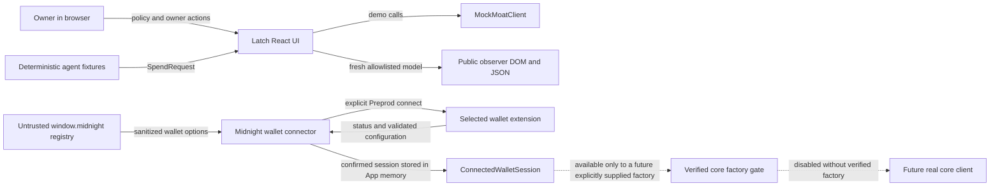

# Latch Privacy Model

## 1. Purpose and current implementation status

This document describes the privacy boundaries implemented by the Latch frontend. It is an implementation document, not a claim that the current repository provides end-to-end cryptographic or ledger privacy.

Latch has two materially different execution paths:

- **Deterministic Demo mode** runs entirely in the browser through `MockMoatClient`. Its commitments, receipt, nullifier, proof timeline, and one-time destination are labeled fixtures. They are not Midnight proofs or transactions.
- **Wallet mode** can discover and connect a compatible Midnight wallet on Preprod with narrowly scoped connector calls. Real capability, proof, and transaction actions remain disabled until a verified core-client factory is supplied.

The current **Public observer** view is a strict frontend data projection. It removes owner-only nodes from the rendered and accessible DOM and builds clipboard output from an allowlist. It is **not authentication, authorization, process isolation, a separate origin, or a public-only server response**. Owner-private values can still exist elsewhere in the same browser JavaScript realm.

That distinction is the center of this model:

> The observer projection minimizes what the UI renders and copies. It does not make an untrusted user of the same browser session unable to inspect owner data.

## 2. Security and privacy objectives

The implemented frontend aims to:

1. Keep owner policy and request details out of the Public observer render model, DOM, accessible-name tree, fixed public transcript, rejection copy, and public receipt JSON.
2. Avoid leaking raw wallet, provider, client, or proof errors into rendered messages or logs.
3. Request only the wallet connector methods required to confirm a Preprod session and read its service configuration.
4. Prevent stale asynchronous work from turning an abandoned connection or authorization into a new UI claim.
5. Label deterministic artifacts truthfully and fail closed when the real core handoff is absent.
6. Avoid browser persistence, telemetry, and application-level logging of private values in the current frontend.

This model does not attempt to protect private values from a compromised owner device, malicious browser extension, developer tools user, operating-system clipboard observer, screen recorder, or unverified future core implementation.

## 3. Actors

| Actor | Role | Data it may legitimately handle in the current frontend |
| --- | --- | --- |
| Owner | Creates, reviews, uses, and revokes a capability | Readable policy values, readable demo requests, local rejection reasons, owner receipt fields |
| Deterministic agent simulator | Supplies the fixed CodeShield and AlphaSignal requests | Service, amount, category, merchant fixture, and request nonce |
| Merchant/service fixture | Supplies a demo identity and meta-address | Merchant ID, display name, service name, and demo meta-address |
| Public observer | Reads the allowlisted frontend projection | Opaque capability state, commitments, aggregate proof result, allowlisted receipt data |
| Latch React UI | Orchestrates owner and observer render trees | Owner state in the root component; fresh public projections for observer rendering |
| `MockMoatClient` | Models the demo state machine in memory | Policy, spend state, consumed nullifiers, approved receipt commitments, fixture inputs |
| Injected Midnight wallet | Offers a connector and confirms a Preprod connection | Wallet-controlled metadata, connection state, and service configuration |
| Verified core-client factory | Future integration seam for real actions | Not present in the current implementation; its data contract is not inferred here |

## 4. Trust-boundary map



### 4.1 Boundary inventory

| Boundary | Trusted assumption | Implemented control | Residual risk |
| --- | --- | --- | --- |
| Owner state to observer model | Input objects may contain unexpected private fields | New objects are constructed from explicit fields; allowed leaves are type- and format-checked | The original owner object remains in the same JavaScript realm |
| Observer model to DOM | React renders the supplied model as text | A separate observer subtree is mounted; the owner subtree and open dialogs are unmounted | Same-origin scripts and developer tools can inspect application memory |
| Receipt to clipboard | Runtime objects may be extended or poisoned | Owner and observer serializers recursively rebuild explicit payloads | The operating-system clipboard outlives the component and may be read by other software |
| Wallet registry to picker | `window.midnight` and its properties are attacker-controlled input | Defensive enumeration, guarded property access, text sanitization, strict semver, generated IDs, raster data-icon allowlist | A malicious installed extension still executes with extension privileges |
| Connected wallet to Latch | Status and configuration are wallet-controlled | Status is checked before and after configuration; network and endpoint schemes are validated | Provider behavior, availability, privacy policy, and traffic metadata are outside this frontend |
| Errors to user-visible copy | Thrown values may contain policy, account, endpoint, or stack data | Fixed public errors replace raw connector and client reasons | Browser or extension diagnostics outside Latch may still record their own data |
| Async operation to current UI | A response may arrive after reset, navigation, or mode change | Epoch and in-flight guards ignore stale results and duplicate activation | They do not cancel work already executing inside an extension or future core service |

## 5. Data classification

### 5.1 Public frontend projection

These fields are intentionally available to the Public observer view after validation.

| Data | Owner DOM | Observer DOM | Observer receipt clipboard | Notes |
| --- | --- | --- | --- | --- |
| Capability ID | Yes | Yes | Yes | Must be an opaque `cap_...` identifier or a 32-byte hexadecimal value |
| Capability status | Yes | Yes | Yes, as `capabilityStatus` | Only `active` or `revoked` |
| Policy commitment | Yes | Yes | No | Rendered with capability state; not part of observer receipt JSON |
| Spend-state commitment | Yes | Yes | No | Rendered with capability state; not part of observer receipt JSON |
| Aggregate proof state | Yes | Yes | Approved only, as `proofStatus` | Observer values are `idle`, `running`, `approved`, or `rejected`; no steps are included |
| Request commitment | Yes after approval | Yes after approval | Yes | Must be a 32-byte hexadecimal commitment |
| Receipt commitment | Yes after approval | Yes after approval | Yes | Must be a 32-byte hexadecimal commitment |
| Nullifier | Yes after approval | Yes after approval | Yes | Must be a 32-byte hexadecimal value |
| Receipt verification state | Yes | Yes | Yes, as `verificationStatus` | `idle`, `verifying`, `verified`, or `invalid` |
| Fixed public transcript | No separate owner projection | Yes | No | Generated from aggregate state; it never consumes owner event text |
| Generic rejection | Included beside owner explanation | Yes | No receipt is copied | Byte-identical for every private rejection code |

The exact observer receipt clipboard object contains seven top-level keys, in this order:

```json
{
  "capabilityId": "<opaque capability identifier>",
  "requestCommitment": "<32-byte hex commitment>",
  "receiptCommitment": "<32-byte hex commitment>",
  "nullifier": "<32-byte hex value>",
  "capabilityStatus": "active | revoked",
  "proofStatus": "approved",
  "verificationStatus": "idle | verifying | verified | invalid"
}
```

The serializer does not spread the source object. It reconstructs every field and rejects malformed allowed leaves rather than serializing an object in place of a primitive.

### 5.2 Owner-only, internal, or currently unrequested data

| Data | Owner DOM | Observer DOM | Observer clipboard | Current treatment |
| --- | --- | --- | --- | --- |
| Capability alias | Yes | No | No | Held in owner state and the demo client |
| Agent name | Yes | No | No | Held in the private policy fixture |
| Per-transaction limit | Yes | No | No | Parsed as an exact decimal string; never coerced through floating point |
| Total and remaining budget | Yes | No | No | Held as exact decimal strings in demo memory |
| Maximum and remaining uses | Yes | No | No | Owner capability state only |
| Allowed category | Yes | No | No | Owner policy only |
| Request amount and category | Yes | No | No | Shown on owner service cards and structured-request dialog |
| Service and merchant identity | Yes | No | No | Includes service ID/name, merchant ID/name, and meta-address |
| Request nonce | Yes in owner structured JSON | No | No | Used to derive the deterministic nullifier |
| Private rejection code/reason | Yes as owner-readable explanation | No | No | Replaced by one fixed public sentence |
| Proof-step labels, position, details, and timing | Yes | No | No | Observer projection exposes only aggregate status and an empty step array |
| One-time destination fixture | Yes after approval | No | No | Included in the owner receipt clipboard payload |
| Ephemeral public key and view tag fixtures | Yes after approval | No | No | Included in the owner receipt clipboard payload |
| Transaction kind/network/hash/explorer URL | Owner only when returned by the normalized client | No | No | The serializer type-checks leaves and allowlists transaction kind/network enums; the UI separately requires HTTPS before rendering an explorer link; unknown core hash/address-format validation remains a handoff requirement |
| Wallet display name | Wallet connection screen only | No | No | Sanitized before rendering; no address is requested |
| Wallet service configuration | No | No | No | Validated copy remains in the connected session in memory |
| Connected wallet API handle | No | No | No | Retained only for revalidation and a future verified core factory |
| Wallet addresses, balances, history, signing, transfer, and intent data | No | No | No | Current connector never requests these methods |
| Witnesses, seeds, private keys, or signing keys | Never | Never | Never | The frontend has no legitimate path for these values |

### 5.3 Owner clipboard is a separate disclosure decision

The owner can copy individual capability identifiers and commitments. The owner receipt JSON is also allowlisted, but its allowlist is intentionally broader than the observer allowlist. It may contain:

- capability ID, request commitment, receipt commitment, and nullifier;
- one-time destination, ephemeral public key, view tag, and fixture flag; and
- transaction kind and network, plus a transaction hash or explorer URL only when present.

It never copies policy, merchant, wallet, witness, or private rejection fields, including runtime-injected nested fields. Even so, copying is an explicit export from Latch to the operating-system clipboard. The user must treat the owner receipt as sensitive.

## 6. Observer projection mechanics

The observer boundary has three independent layers.

### 6.1 Fresh capability projection

`toObserverCapability` creates a plain object containing only:

- `capabilityId`;
- `status`;
- `policyCommitment`; and
- `spendStateCommitment`.

It does not clone the owner object, spread it, or retain a nested reference. Identifiers, status, and commitments are validated before they enter the public model.

### 6.2 Aggregate authorization projection

`buildObserverWorkspaceModel` reads proof-step statuses only to calculate one aggregate result. It publishes `steps: []` in all states. This prevents a failure location, label, detail, step count, or ordering position from becoming an observer side channel.

If a rejection object exists or any proof step has failed:

- the aggregate result is `rejected`;
- any previous receipt is suppressed;
- the transcript uses fixed generic entries; and
- the only rejection text is `Authorization rejected. No private policy values were disclosed.`

While a new authorization is busy, the observer model reports `running` before considering an older receipt. This prevents a stale approved receipt from being presented as the result of the current request.

### 6.3 Separate rendered subtree

The root component conditionally renders either `CapabilityDashboard` or `ObserverWorkspace`. Switching views unmounts the complete owner subtree, including an open structured-request dialog, and mounts the observer subtree with a newly constructed model. Private owner nodes are not hidden with CSS.

This protects the DOM and accessible tree. It does not clear the root component state or isolate the observer in a new security principal.

## 7. Surface-by-surface treatment

| Surface | Current behavior | Important limitation |
| --- | --- | --- |
| Visual DOM | Observer renders only allowlisted public fields and fixed copy | Owner data can remain in JavaScript memory |
| Accessibility tree | Owner controls/dialogs are unmounted; observer has its own headings, live regions, and controls | Browser assistive tooling shares the same local session |
| Clipboard | Public receipt uses the exact seven-field serializer; owner receipt uses its separate recursive allowlist | Clipboard contents persist outside the app and are not erased by reset |
| React state | Holds owner capability, request outcome, proof steps, receipt, and events during the session | Observer mode does not purge this state |
| Demo client memory | Holds the current capability, consumed-nullifier set, and approved receipt commitments | UI reset/home does not guarantee immediate erasure from the existing client instance |
| Browser storage | The current frontend does not write local storage or session storage | Browser, extensions, or future dependencies may maintain their own storage |
| URL | Private values are not placed in the query string, fragment, or route | Referrer and navigation behavior must be reassessed if routing is added |
| Application logs | Production source does not log policies, requests, receipts, wallet configuration, provider payloads, or raw errors | Browser/extension/runtime diagnostics are outside this guarantee |
| Telemetry | No analytics or telemetry integration exists in the current frontend | Any future monitoring must start from a deny-by-default field allowlist |
| Demo network | Fixture hashing uses local Web Crypto; the demo client makes no proof or transaction request | Loading the web application itself still reveals ordinary web metadata to its host |
| Wallet connection | Only selected connector status and configuration are requested after approval | The extension and its configured providers have their own privacy properties |
| Error UI | Fixed application and wallet messages replace raw thrown data | An underlying extension or provider may log its own raw failure |

## 8. Browser-memory lifecycle

Private demo values are deliberately not persisted by Latch, but they are not treated as securely erasable memory.

- Policy and authorization values live in React state and the `MockMoatClient` instance.
- `Reset demo`, `New capability`, mode changes, and return-to-home advance an operation epoch. Late UI callbacks are ignored after that boundary.
- Those controls clear the active UI state, but the existing mock client may retain its prior capability and receipt/nullifier sets until a new capability overwrites them or the page is reloaded.
- Leaving Wallet mode clears the session from root state and unmounts the panel. JavaScript garbage collection timing is not controllable, and the wallet extension may retain its own connection state.
- Reloading or closing the page creates the cleanest available frontend boundary, but neither action is a secure memory-wipe guarantee.
- Clipboard contents, screenshots, screen recordings, browser crash reports, swap, and extension storage are outside Latch's erasure control.

For a genuinely public display, use a separate public-only client that never receives owner data. Do not hand the owner's active browser session to an untrusted observer and rely on the toggle as access control.

## 9. Wallet and provider boundary

Wallet injection is handled as untrusted input.

### 9.1 Discovery

- The connector enumerates `Object.values(window.midnight)` rather than trusting a hard-coded registry key.
- Registry access, enumeration, and property getters are guarded because proxies and getters can throw.
- Wallet IDs are generated locally and do not embed wallet-controlled names.
- Names and versions are bounded, normalized, stripped of control/markup characters, and rendered as React text.
- Only base64 PNG, JPEG, or WebP data URLs are accepted as icons. Remote URLs, SVG, script URLs, credentials, and tracking images are rejected.
- Connector API compatibility is checked against `^4.0.0`; the installed interface dependency is pinned separately by the lockfile.
- Multiple compatible wallets require an explicit selection. A single option may be preselected, but it is never auto-connected.

### 9.2 Connection and least authority

- Wallet mode offers only the verified Preprod target.
- Connection occurs only after the user activates `Connect on Preprod`.
- The permission hint contains only `getConnectionStatus` and `getConfiguration`.
- The connector does not call address, balance, transaction-history, signing, transfer, intent, shielded-address, or unshielded-address methods.
- Connection status is checked before and after configuration is read to catch disconnect and network-switch races.
- Configuration must report Preprod and valid `https:`/`wss:` service endpoints without embedded credentials.
- A fresh plain configuration object is returned instead of exposing the wallet-controlled object directly.
- Focus and visibility changes trigger revalidation without requesting additional permissions.
- Raw reasons, endpoint values, account hints, and stacks are reduced to fixed public errors.

### 9.3 Real-action gate

A confirmed wallet session is not presented as a capability, proof, or transaction. The session can reach a real `MoatClient` only through an explicitly supplied `VerifiedCoreClientFactory`. Without that factory, `createRealMoatClient` throws a fixed `CORE_HANDOFF_REQUIRED` public error and does not expose provider payloads.

No core package name, contract address, amount unit, proof shape, receipt shape, deployed network fact, or transaction behavior is inferred by the frontend.

## 10. Known metadata and side channels

The observer projection intentionally reveals the public fields in Section 5. It can also reveal coarse interaction metadata visible on screen:

- whether a capability is active or revoked;
- whether no request, a request in progress, an approval, or a rejection is currently projected;
- that an approved receipt exists and whether its verification passed;
- when the user changes views or invokes a public action; and
- the lengths and update timing of the fixed UI states.

Individual proof steps, step timing, failure position, owner event text, merchant identity, request amount, and private reason are deliberately omitted. The frontend does not claim that aggregate timing is constant-time.

Ordinary deployment metadata is also outside the observer serializer: IP address, TLS/server logs, asset requests, browser fingerprinting, DNS, extension presence, wallet/provider traffic, and future public-ledger metadata. These must be evaluated with the deployment and verified core topology.

## 11. Hostile-input and privacy test strategy

The automated tests exercise the boundary with private sentinels, runtime-injected fields, malformed leaves, asynchronous updates, and hostile wallet objects.

| Test area | File | What is asserted |
| --- | --- | --- |
| Capability projection | `web/src/privacy/observer-serializer.test.ts` | A hostile owner object becomes an exact four-field plain object; banned keys and values are absent |
| Receipt projection | `web/src/privacy/observer-serializer.test.ts` | Approved observer receipt has exactly seven fields; added root and nested private fields cannot hitchhike |
| Rejection equivalence | `web/src/privacy/observer-serializer.test.ts` | Limit, budget, use-count, category, replay, revoked, and unknown reasons produce byte-identical generic rejection models |
| Proof side channels | `web/src/privacy/observer-serializer.test.ts` | Labels, safe details, owner events, positions, and stale receipts are removed on failure or while a new request runs |
| Malformed public leaves | `web/src/privacy/observer-serializer.test.ts` | Nested objects, non-opaque IDs, and malformed commitments are rejected instead of serialized |
| DOM replacement | `web/src/privacy/observer-integration.test.tsx` | Switching views unmounts owner controls and an open request dialog; private sentinels are absent from the whole document HTML |
| Async DOM mutation | `web/src/privacy/observer-integration.test.tsx` | Every mutation snapshot remains free of owner sentinels while delayed proof callbacks complete |
| Public clipboard | `web/src/privacy/observer-integration.test.tsx` | Copied observer JSON has only the seven allowed keys and no destination or fixture-private value |
| Rejection/replay/revoke UI | `web/src/privacy/observer-integration.test.tsx` | Public rejection is generic; failure steps, replay destination, stale receipt, and owner actions are absent; revoked status remains public |
| Storage and URL | `web/src/privacy/observer-integration.test.tsx` | Local/session storage, query string, and fragment remain empty on the tested flow |
| Owner clipboard | `web/src/lib/receipt-serialization.test.ts` | Recursive explicit owner allowlist excludes injected policy, merchant, wallet, witness, and rejection fields |
| Wallet registry | `web/src/wallet/midnight-wallet-connector.test.ts` | Missing, throwing, proxied, duplicated, malformed, and incompatible connectors fail safely |
| Wallet metadata | `web/src/wallet/midnight-wallet-connector.test.ts` and `WalletConnectionPanel.test.tsx` | Control characters and markup become inert text; remote, SVG, and script icons are refused |
| Wallet authority | `web/src/wallet/midnight-wallet-connector.test.ts` | Only status/configuration are hinted and called; sensitive methods remain untouched |
| Wallet race/error handling | Wallet connector and panel tests | Network-switch races, unsafe endpoints, raw secret errors, focus revalidation, duplicate clicks, and late abandoned connections fail closed |
| Core handoff gate | `web/src/services/moat-adapter.test.ts` | Missing factory exposes only fixed public copy; a session reaches only an explicitly supplied factory |

These tests establish current frontend behavior. They do not audit browser engines, extensions, deployment infrastructure, Compact contracts, proof systems, or a future core client.

## 12. Logging, telemetry, URL, and secret policy

- Do not add `console.*` calls for policies, requests, receipts, wallet configuration, connected API objects, provider payloads, raw errors, witnesses, or addresses.
- The application error boundary intentionally discards its raw error and recovery metadata.
- Do not add private values to URLs, route parameters, browser storage, analytics events, crash reporters, support widgets, or third-party source-map services.
- Treat every `VITE_*` variable as public. Never place a key, seed phrase, signing key, witness, private policy, wallet secret, or credential in frontend environment variables.
- Any future telemetry must document a small public allowlist, retention, recipients, and opt-out behavior before implementation.
- Never use a raw core or wallet error message as user-visible copy. Map it to a stable `PublicClientError` first.

## 13. Explicit non-claims and limitations

The current implementation does **not** claim:

1. That Public observer mode authenticates a viewer or prevents a same-device user from accessing owner data.
2. That switching to Public observer securely erases owner values from JavaScript memory, extension state, clipboard, screenshots, or operating-system memory.
3. That Demo mode produces a zero-knowledge proof, Compact contract call, Midnight transaction, on-chain receipt, wallet transfer, or real one-time address.
4. That a successful wallet connection proves ownership of a particular address, creates a capability, submits a transaction, or authorizes spending.
5. That any contract is deployed on Preprod or mainnet, or that the product is production-ready.
6. That a contract hides any exact set of fields until the verified contract/core handoff establishes those facts.
7. Total anonymity, constant-time behavior, complete transaction-graph privacy, resistance to traffic analysis, or protection against public-ledger metadata.
8. Formal verification, an independent security audit, cryptographic review, custody safety, or protection against a compromised browser, extension, provider, device, or future core client.
9. Secure deletion of private data after reset, navigation, reload, or garbage collection.
10. Privacy properties for deployment logs, RPC/indexer/prover operators, or external services that have not been integrated and verified.

## 14. Requirements for a genuine public-observer boundary

Before Public observer can be described as an access-control or confidentiality boundary, it needs a design in which private data never enters the observer principal. At minimum:

1. Serve observer data from a public-only API or event source with an explicit schema and recursive allowlist.
2. Run the observer on a separate route and preferably a separate origin/process that never loads owner state, wallet handles, provider configuration, or private client bundles.
3. Add authentication and authorization for owner functions; do not implement them as a visual toggle.
4. Define public contract events and receipt fields from verified core/contract behavior.
5. Test network responses, caches, service workers, source maps, error reporting, server logs, and browser storage in addition to the DOM.
6. Threat-model timing, request correlation, wallet/provider metadata, ledger visibility, and revocation/verification event linkage.
7. Obtain an independent review of the integrated contract, proof, client, deployment, and frontend boundaries before making production privacy claims.

## 15. Core-handoff privacy checklist

The real adapter must remain blocked until the teammate-owned handoff supplies verified answers for all of the following:

- exact public and private classification for every input, return field, event, and error;
- contract/package interfaces and versioned types;
- amount units and lossless conversion rules;
- proof, receipt, nullifier, destination, verification, replay, and revocation semantics;
- wallet/provider permissions and whether any additional method is truly required;
- provider topology and which endpoints or operators receive which data;
- transaction fields that may be rendered or copied, including validated explorer links;
- safe public error mapping with raw payload redaction;
- stale-operation, concurrency, and retry behavior;
- tests proving no private core field reaches observer models, DOM, clipboard, URLs, logs, or telemetry; and
- verified deployment/network facts suitable for documentation.

Until those facts are received, the frontend must continue to show the connected-wallet handoff gate and offer the deterministic demo without claiming a real action.
