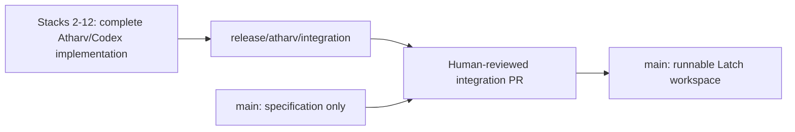

# Latch Atharv/Codex release handoff

This is the aggregate review and merge guide for the complete Atharv/Codex
workstream. The final integration branch contains every implementation,
hardening, test, documentation, and reproducible-artifact commit described in
the Atharv build brief. It intentionally excludes Ashiha's independently owned
core work.

## Release decision

| Fact | Value |
| --- | --- |
| Integration branch | `release/atharv/integration` |
| Target branch | `main` |
| Verified stack input | `fix/atharv/wallet-focus-stability` at `bd02c301bcbffcca431c2f5ecc6e3a6b95bb4178` |
| Node support contract | `>=22.13.0 <23`; `.nvmrc` and CI use `22.13.0` |
| Application tests | 130 passing tests in 17 files |
| Dependency audit | Zero known vulnerabilities at `--audit-level=low` |
| Public demo URL | `[DEPLOYMENT FACT REQUIRED]` |
| Real Midnight core | `[CORE FACT REQUIRED]` |
| Final merge | Human reviewer required; the PR author must not merge it |

The code is ready for aggregate human review and default-branch integration.
It is not a production, real-payment, real-proof, public-deployment, or security
audit claim.

## Why the integration pull request is required

The earlier feature pull requests were deliberately stacked against feature
branches. Some child branches were merged after their parent branch had already
been merged, so those later commits did not flow back into `main`. The default
branch currently has the specification but not the runnable web workspace.

Merging a later stack PR into its feature-branch base still does not propagate
that base back into `main`. The final integration PR is therefore the explicit,
reviewable aggregate edge from the verified stack tip to the default branch.



## Included Atharv/Codex scope

- React/Vite/TypeScript workspace and accessible Latch visual system.
- Deterministic private-capability builder and lifecycle.
- Serialized allow/reject/replay payment-gate model with exact decimal strings,
  single-use nullifiers, receipts, verification, revocation, and reset.
- Structurally separate Public Observer projection and clipboard allowlists.
- Hardened Midnight DApp Connector discovery/selection boundary for Preprod,
  with least-permission hints, race checks, fixed public errors, and fail-closed
  behavior when the real core factory is absent.
- Security and truthfulness corrections, error redaction, response-header
  configuration, runtime notices, and adversarial regression tests.
- Least-privilege CI, exact runtime pin, lockfile install, audit, dependency-tree,
  credential-pattern, and clean-tree gates.
- Architecture, privacy, demo, Devpost, submission, deployment, and evidence
  documentation.
- Reproducible `/Latch/` static bundle with a clean-remote SHA-256 manifest.

No `api/**` or `contract/**` path is introduced or modified by this workstream.

## Current pull-request ledger

This table records GitHub state at the integration handoff. It is evidence, not
an instruction to represent open reviews as approved.

| Stack | Pull request | Current state |
| ---: | --- | --- |
| 1 | [Specification](https://github.com/CipherCollective/Latch/pull/1) | Merged by Ashiha |
| 2 | [Accessible UI shell](https://github.com/CipherCollective/Latch/pull/2) | Merged by Atharv, the author; process exception |
| 3 | [Private capability flow](https://github.com/CipherCollective/Latch/pull/3) | Merged by Ashiha |
| 4 | [Deterministic payment gate](https://github.com/CipherCollective/Latch/pull/4) | Merged by Ashiha |
| 5 | [Public Observer projection](https://github.com/CipherCollective/Latch/pull/5) | Merged by Ashiha |
| 6 | [Midnight wallet boundary](https://github.com/CipherCollective/Latch/pull/6) | Merged by Ashiha |
| 7 | [Truthful release boundary](https://github.com/CipherCollective/Latch/pull/7) | Merged by Atharv, the author; process exception |
| 8 | [Automated release gates](https://github.com/CipherCollective/Latch/pull/8) | Open; human review required |
| 9 | [Audited release documentation](https://github.com/CipherCollective/Latch/pull/9) | Open; human review required |
| 10 | [Verified deployment bundle](https://github.com/CipherCollective/Latch/pull/10) | Open; human review required; public host blocked |
| 11 | [Runtime and artifact reproducibility](https://github.com/CipherCollective/Latch/pull/11) | Open; human review required |
| 12 | [Wallet focus revalidation stability](https://github.com/CipherCollective/Latch/pull/12) | Open; human review required |
| 13 | Final integration | `[PULL REQUEST PENDING]` |

PRs #2 and #7 are known no-self-merge process exceptions. They must not be
described as compliant. The final integration PR must be reviewed and merged by
someone other than its author.

## Verification evidence

### Application and supply chain

A clean remote checkout at runtime-correction commit
`480610a888f60ff149bf860115a431193f8cbfd1` was verified under exact Node.js
`22.13.0`:

- `npm ci` completed from the committed lockfile with no `EBADENGINE` warning;
- TypeScript reported no errors;
- all 130 Vitest tests in 17 files passed;
- Vite produced the production bundle;
- `npm audit --audit-level=low` reported zero vulnerabilities;
- `npm ls --all` validated the installed dependency tree;
- Markdownlint reported zero findings;
- `git diff --check` passed and the checkout remained clean; and
- no source map, high-confidence credential pattern, `api/**`, or `contract/**`
  release delta was found.

The later wallet-focus correction was independently verified at
`53a8a58eb70becb6fc3cc3b72d39a874dc01ec82` under the same runtime. Twenty
consecutive focused App/WalletConnectionPanel runs passed, followed by the full
130-test suite, typecheck, build, audit, full dependency tree, Markdownlint,
diff, and clean-tree gates. CI repeats the executable gates on the final
pull-request head.

Remote integration commit `6456ff1e413965b9f1ea16b74ca695a8eb00f701`
was then checked from a new clone under exact Node.js `22.13.0`. It passed the
lockfile install without an `EBADENGINE` warning, typecheck, all 130 tests,
production build, audit, complete dependency tree, Markdownlint, local-link and
credential-pattern checks, source-map rejection, all six committed artifact
byte/SHA-256 assertions, core-path scope check, diff check, and clean tracked
worktree. Subsequent handoff-only commits do not change application or artifact
bytes; CI reruns the executable gates on every final integration head.

### Deployment artifact

The `/Latch/` bundle was rebuilt from the focus-corrected source under Node.js
`22.13.0` at `65a9195cd2e1f514515c3c0480603c45c05ca7c7`. The stale JavaScript chunk was
removed and the manifest was recomputed. `.gitattributes` keeps release inputs
LF-stable across Windows and Unix checkouts. See [`DEPLOYMENT.md`](./DEPLOYMENT.md)
for the full manifest.

### Browser and accessibility

The exact static artifact was served at its production base path and exercised
through landing, create, approve, verify, reject, replay, observer, revoke,
post-revocation disablement, new capability, reset, no-wallet, and compatible
Preprod connector-fixture states. The run recorded:

- zero application console errors;
- zero failed requests and HTTP error responses;
- `THIRD_PARTY_NOTICES.txt` status `200`;
- zero Axe WCAG A/AA findings on the enumerated critical states;
- zero document or wallet-flow overflow at `320x720`; and
- correct focus transfer after in-app navigation.

Desktop `1440x900` and mobile `390x844` captures are retained under
`docs/screenshots/`. The independently repeated `320x720` overflow result is
recorded in [`DEPLOYMENT.md`](./DEPLOYMENT.md).

## Required reviewer procedure

1. Review PRs #8 through #12 and their targeted diffs. Do not infer approval
   from a green automated check.
2. Review the aggregate diff from `main` to `release/atharv/integration`, with
   special attention to the privacy projection, wallet boundary, fixture labels,
   response headers, and generated static artifact.
3. From a new directory, run the commands below under exact Node.js `22.13.0`.
4. Confirm `git diff --name-only origin/main...HEAD` contains no `api/**` or
   `contract/**` path.
5. Confirm the integration PR's required checks are green on its final head.
6. Merge as a non-author reviewer using the repository's evidence-preserving
   merge policy. Do not have Atharv self-merge the PR.
7. Pull the resulting `main` into a clean checkout and repeat the release gates.

```bash
git clone https://github.com/CipherCollective/Latch.git Latch-review
cd Latch-review
git switch release/atharv/integration
nvm use
npm ci
npm run typecheck
npm run test:run
npm run build
npm audit --audit-level=low
npm ls --all
npx --yes markdownlint-cli2@0.18.1 "README.md" "docs/**/*.md" "#node_modules"
git diff --check
git status --short
```

The final `git status --short` output must be empty.

## External facts that remain intentionally open

### Ashiha core handoff

The branch does not contain Ashiha's Compact/core implementation or verified
adapter inputs and outputs. Real contract compilation, circuit behavior,
disclosure classification, provider topology, amount units, proof semantics,
ledger receipt verification, nullifier consumption, deployed address, network,
transaction metadata, and explorer behavior all remain `[CORE FACT REQUIRED]`.

The current real-client seam fails closed. Do not turn fixture evidence into a
core claim when the independent handoff arrives; validate it through the typed
adapter and adversarial tests first.

### Public hosting

GitHub's Pages create-site API returned HTTP `422` with
`Your current plan does not support GitHub Pages for this repository.` The repo
is private under an organization, and no authorized alternative-host project or
credential is available. No visibility, billing, or external project change was
made implicitly.

The static artifact is ready, but URL/incognito/hosted-origin checks remain
`[DEPLOYMENT FACT REQUIRED]`. Choose an approved host, deploy the reviewed
commit, inspect response headers, and rerun the complete browser matrix before
claiming a live demo.

### Human submission work

Video recording, final Devpost fields, teammate attribution, public URL checks,
human approvals, merge, and submission are `[SUBMISSION FACT REQUIRED]`. They
cannot be truthfully completed by repository automation alone.

## Post-merge acceptance

After a non-author merges the integration PR to `main`:

- verify a plain default-branch clone contains `package.json`, `web/`, and the
  complete docs set;
- repeat install, typecheck, tests, build, audit, dependency, and clean-tree
  checks on the merge commit;
- update the live PR ledger if any stack PR state changed;
- retain all core, deployment, and submission placeholders that still lack
  independent evidence; and
- only then mark the default-branch gate complete in the submission checklist.
